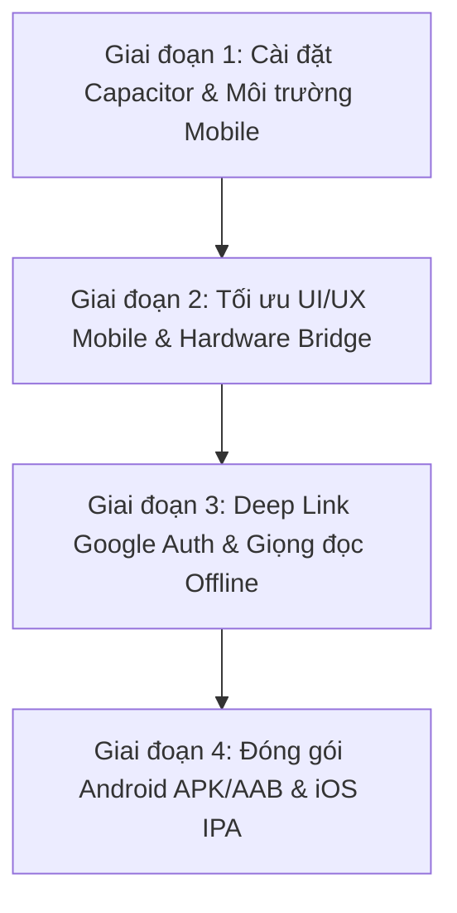

# 📱 Kế Hoạch Triển Khai Mobile App (Android & iOS) Cho Dự Án Toán Vui

Tài liệu này lưu trữ toàn bộ phân tích kỹ thuật, kiến trúc đề xuất và lộ trình chi tiết từng bước để chuyển đổi và đóng gói ứng dụng **Toán Vui** thành ứng dụng di động gốc (**Native Mobile App**) chạy trên cả hai hệ điều hành **Android (.apk / .aab)** và **iOS (.ipa)**.

---

## 1. Phân Tích Hiện Trạng & Lựa Chọn Công Nghệ

### 1.1. Hiện trạng Mã Nguồn
- **Frontend Core:** React 19, Vite, Zustand (state management), React Router DOM (navigation), Framer Motion (hiệu ứng chuyển động mượt mà), Canvas Confetti.
- **Nội dung & Dữ liệu:** Toàn bộ dữ liệu chương trình toán Lớp 1 - 5, trò chơi, câu chuyện, thử thách và huy hiệu được tổ chức độc lập dưới dạng module tĩnh tại `client/src/data/`.
- **Âm thanh:** Web Audio API (`AudioContext`) tự tổng hợp âm thanh tức thì không phụ thuộc file mạng, kết hợp giọng đọc sư phạm chuẩn tiếng Việt (`speechHelper.js`).
- **Giao diện & Responsive:** Đã được tối ưu hóa xuất sắc cho màn hình điện thoại di động (Bottom Navigation bar, kích thước phím bấm chunky kid-friendly, bố cục thích ứng màn hình 375px - 430px).
- **Cơ sở Dữ liệu & Đám mây:** Supabase PostgreSQL hỗ trợ xác thực Google OAuth, quản lý đa hồ sơ bé trong gia đình, đồng thời hỗ trợ chế độ Khách (Guest mode) chạy ngoại tuyến 100%.

### 1.2. Giải Pháp Tối Ưu: **Capacitor (Ionic Capacitor v6/v7)**

| Tiêu chí | Giải pháp Capacitor (Khuyên dùng) | React Native / Expo | Flutter |
| :--- | :--- | :--- | :--- |
| **Mức độ tái sử dụng code** | **95% - 98%** (Dùng lại nguyên vẹn toàn bộ React, CSS, Framer Motion, Zustand, Audio) | **~25%** (Phải viết lại toàn bộ giao diện từ HTML/CSS sang `View`/`Text`) | **~5%** (Phải viết lại từ đầu bằng ngôn ngữ Dart) |
| **Thời gian hoàn thiện** | **Nhanh nhất (1 - 2 tuần)** | Rất lâu (2 - 3 tháng) | Rất lâu (3 - 4 tháng) |
| **Chi phí bảo trì** | **1 codebase duy nhất** (1 lần cập nhật đồng thời áp dụng cho Web, Android, iOS) | Phải duy trì 2 codebase song song | Phải duy trì 2 codebase song song |
| **Tính năng phần cứng** | Đầy đủ thông qua Capacitor Plugins (Rung Haptics, Splash Screen, Status Bar, Back button, File system) | Native APIs | Native APIs |
| **Hiệu năng trải nghiệm trẻ em** | Trực tiếp kế thừa 60-120fps CSS/Framer Motion, âm thanh tức thì | Rất tốt | Rất tốt |
| **Khả năng lên App Store / CH Play** | Đầy đủ điều kiện phê duyệt của Apple & Google | Đầy đủ điều kiện | Đầy đủ điều kiện |

---

## 2. Các Yêu Cầu & Cải Tiến Kỹ Thuật Cho Mobile

### 2.1. Tai thỏ & Vùng An Toàn (Safe Areas / Notch / Dynamic Island)
- Thêm `viewport-fit=cover` và `maximum-scale=1.0, user-scalable=no` vào thẻ `<meta name="viewport">` trong `client/index.html`.
- Định nghĩa biến CSS Safe Area Inset:
  ```css
  :root {
    --sat: env(safe-area-inset-top, 0px);
    --sab: env(safe-area-inset-bottom, 0px);
    --sal: env(safe-area-inset-left, 0px);
    --sar: env(safe-area-inset-right, 0px);
  }
  ```
- Cập nhật `.header`: Thêm `padding-top: var(--sat)` để tránh bị che bởi tai thỏ / Dynamic Island trên iPhone hoặc thanh trạng thái trên Android.
- Cập nhật `.bottom-nav`: Giữ khoảng cách an toàn với thanh vuốt cử chỉ dưới đáy (`var(--sab)`).

### 2.2. Rung Phản Hồi Xúc Giác (Native Haptics Feedback)
- Tích hợp `@capacitor/haptics`:
  - `Impact.Light`: Rung nhẹ khi nhấn các nút tùy chọn, lật thẻ, chọn đáp án.
  - `Notification.Success`: Rung chúc mừng khi giải đúng bài toán, vượt qua màn chơi.
  - `Notification.Warning`: Rung cảnh báo khi chọn sai kết quả.

### 2.3. Xử Lý Nút Back Phần Cứng Trên Android (Hardware Back Button)
- Tích hợp `@capacitor/app` lắng nghe sự kiện `backButton`:
  - Khi đang mở Modal (AuthModal, ProfileSwitcherModal, MascotBubble): Tự động đóng modal.
  - Khi đang làm bài học (`/lesson/:id`): Hiển thị dialog "Bé có muốn tạm dừng bài học không?" tránh mất điểm bài học dở dang.
  - Khi đang ở trang chủ (`/`): Bấm 2 lần trong 2 giây để thoát ứng dụng.

### 2.4. Biểu Tượng Ứng Dụng & Màn Hình Chờ (App Icon & Splash Screen)
- Tích hợp `@capacitor/assets`:
  - Tự động sinh đầy đủ kích thước icon cho Android (Adaptive Icons nền tròn/vuông) và iOS (1024x1024, @2x, @3x) từ logo Chú Cú Mèo 🦉.
  - Màn hình Splash Screen bản địa hiển thị logo Cú Mèo trên nền `#4ECDC4`, chuyển mượt vào ứng dụng mà không có màn hình trắng.

### 2.5. Đăng Nhập Google & Deep Linking
- Cấu hình Custom Scheme: `toanvui://`
- Thiết lập Redirect URL trên Supabase Auth: `toanvui://auth/callback`
- Lắng nghe sự kiện `appUrlOpen` từ `@capacitor/app` để nhận `access_token` và đồng bộ phiên đăng nhập tự động.

### 2.6. Khả Năng Hoạt Động Ngoại Tuyến (Offline-First)
- Toàn bộ bài học, trò chơi, bảng cửu chương, âm thanh Web Audio hoạt động 100% không cần internet.
- Khi có mạng trở lại (`@capacitor/network`), hệ thống tự động đồng bộ tiến độ bài tập lên đám mây Supabase.

---

## 3. Lộ Trình Triển Khai Chi Tiết (4 Giai Đoạn)



### Giai đoạn 1: Thiết lập Capacitor Core & Khởi tạo Dự án
1. Cài đặt các gói phụ thuộc vào `client/`:
   ```bash
   npm install @capacitor/core @capacitor/cli @capacitor/android @capacitor/ios
   npm install @capacitor/haptics @capacitor/status-bar @capacitor/splash-screen @capacitor/app @capacitor/network
   ```
2. Khởi tạo cấu hình `capacitor.config.json`:
   ```json
   {
     "appId": "com.toanvui.app",
     "appName": "Toán Vui",
     "webDir": "dist",
     "server": {
       "androidScheme": "https"
     }
   }
   ```
3. Sinh thư mục native:
   ```bash
   npx cap add android
   npx cap add ios
   ```
4. Bổ sung scripts tiện ích vào `client/package.json`:
   - `"mobile:sync": "vite build && cap sync"`
   - `"mobile:android": "cap open android"`
   - `"mobile:ios": "cap open ios"`

### Giai đoạn 2: Tối ưu UI Mobile & Tích hợp Hardware Bridge
1. Sửa `client/index.html`: Cập nhật `viewport-fit=cover, user-scalable=no`.
2. Tạo tiện ích Haptics: `client/src/utils/hapticsManager.js`.
3. Tạo lifecycle hook: `client/src/hooks/useMobileLifecycle.js` xử lý Android Back Button và Network status.
4. Tinh chỉnh `Header.css` và `BottomNav.css` với biến `--sat` và `--sab`.
5. Tạo Splash Screen & App Icons với `@capacitor/assets`.

### Giai đoạn 3: Deep Linking & Giọng đọc Mobile
1. Cấu hình Intent Filter trong `android/app/src/main/AndroidManifest.xml` và URL Types trong `ios/App/App/Info.plist`.
2. Kết nối `App.addListener('appUrlOpen')` với `useAuthStore.js`.
3. Tối ưu hóa `speechHelper.js` để tận dụng bộ giọng đọc tiếng Việt bản địa của iOS và Android WebView.

### Giai đoạn 4: Kiểm thử, Đóng gói Bản Cài Đặt & Lên Store
1. **Android:**
   - Biên dịch file cài đặt thử nghiệm Debug APK:
     ```bash
     cd client/android && ./gradlew assembleDebug
     ```
     -> File xuất ra: `android/app/build/outputs/apk/debug/app-debug.apk` (có thể gửi qua Zalo/Drive để cài lên máy con học ngay).
   - Tạo Release Keystore và build Android App Bundle (`.aab`) để phát hành Google Play Store.
2. **iOS:**
   - Mở Xcode: `npx cap open ios`
   - Cấu hình Apple Team & Signing Certificate.
   - Xuất file `.ipa` hoặc đẩy lên TestFlight để thử nghiệm trên iPhone/iPad.
3. **Tuân thủ chính sách dành cho trẻ em (Kids Category Compliance):**
   - Đảm bảo tuân thủ Google Families Policy và Apple Guideline 1.3 (không quảng cáo theo dõi, có cổng bảo vệ phụ huynh khi mở liên kết bên ngoài).

---

## 4. Danh Sách Lệnh Thao Tác Nhanh (Cheatsheet)

| Thao tác | Câu lệnh thực hiện |
| :--- | :--- |
| Build mã nguồn & đồng bộ sang Mobile | `cd client && npm run mobile:sync` |
| Mở dự án Android trong Android Studio | `cd client && npx cap open android` |
| Mở dự án iOS trong Xcode | `cd client && npx cap open ios` |
| Biên dịch file APK Android trực tiếp bằng CLI | `cd client/android && ./gradlew assembleDebug` |
| Cập nhật riêng thay đổi của Web sang Mobile | `cd client && npm run build && npx cap copy` |
| Kiểm tra tình trạng môi trường Mobile | `cd client && npx cap doctor` |

---

*Tài liệu này được tạo và lưu trữ cố định trong dự án để sẵn sàng kích hoạt bất kỳ lúc nào.*
