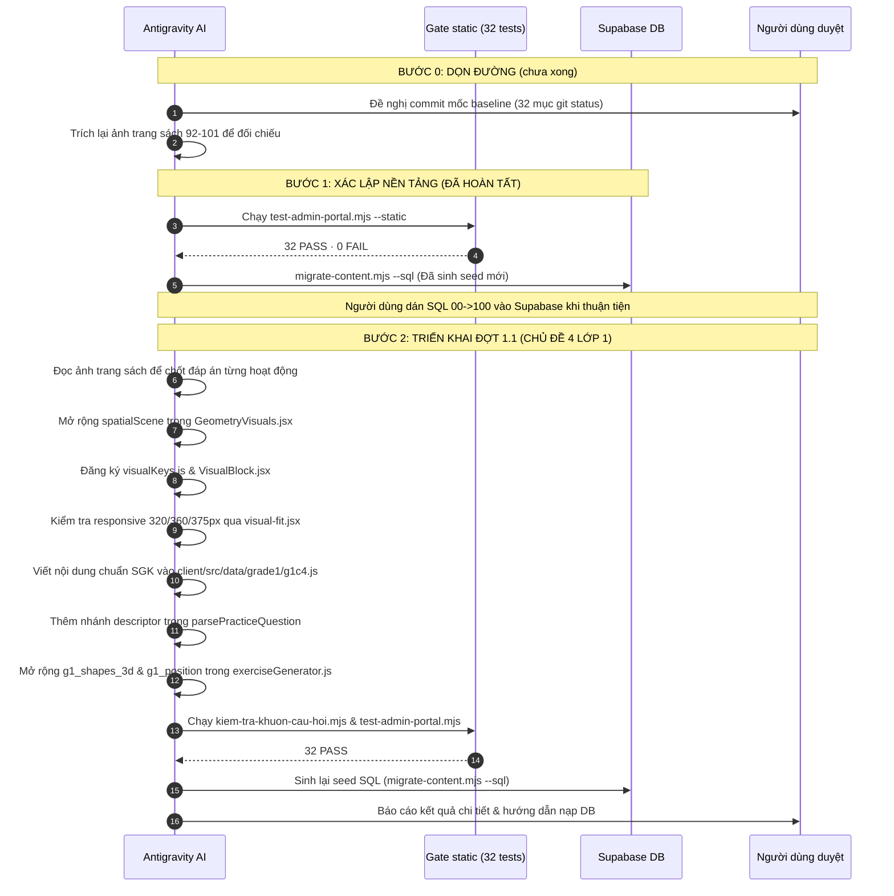

# Kế hoạch chuẩn hóa toàn diện: Tích hợp Khám phá, Hoạt động, Luyện tập chuẩn SGK vào Hệ thống Bài học & Luyện tập

**Ngày cập nhật:** 2026-09-24
**Tài liệu nguồn:** Toàn bộ file PDF và OCR Markdown trong thư mục `docs/Data Source/` (Bộ sách _Kết nối tri thức với cuộc sống_, Nhà xuất bản Giáo dục Việt Nam)
**Tình trạng kiểm soát chất lượng (Quality Gate):** `32 PASS · 0 FAIL · 0 SKIP` (đo lại ngày 2026-09-24)
**Trạng thái kế hoạch:** đã gộp bản hiệu chỉnh 2026-09-24 (đính chính nội dung SGK + ghi chú kỹ thuật + danh mục nguồn đáp án).

---

## 1. Trạng thái 3 việc chặn (Đã xử lý hoàn tất trước Đợt 1.1)

| Hạng mục chặn                 | Hiện trạng trước xử lý                                                                                                                                                                                                                                             | Giải pháp & Kết quả đã thực hiện                                                                                                                                                                                                                                                                                                                                                                                                                                                                                                                                                                                                                                                 |
| :---------------------------- | :----------------------------------------------------------------------------------------------------------------------------------------------------------------------------------------------------------------------------------------------------------------- | :------------------------------------------------------------------------------------------------------------------------------------------------------------------------------------------------------------------------------------------------------------------------------------------------------------------------------------------------------------------------------------------------------------------------------------------------------------------------------------------------------------------------------------------------------------------------------------------------------------------------------------------------------------------------------- |
| **(a) Cổng kiểm tra tự động** | `28 PASS · 4 FAIL` (S-15, S-23, S-24, S-32) — **cùng một nguyên nhân duy nhất**: import ESM thiếu đuôi `.js` trong 5 file `gradeNData.js` nên **Node không nạp được dữ liệu** (Vite vẫn build được nên app không báo gì). Kèm theo, dữ liệu Lớp 1 đang bị rút gọn. | **ĐÃ XỬ LÝ:** 1. Thêm đuôi `.js` vào toàn bộ **51 dòng import** trong 5 file `gradeNData.js`. 2. Phục hồi đầy đủ Lớp 1: **10 chương · 97 bài · 541 slide** trong `client/src/data/grade1/g1c1.js` … `g1c10.js`. Tập `id` khớp hệt bản HEAD (**97/97, `Compare-Object` rỗng**) nên **không mất tiến độ của bé**. 3. Việc **riêng, KHÔNG phải nguyên nhân của 4 cổng đỏ**: bổ sung khai báo `mangObject` (`items`, `planeShapes`) trong `admin/src/lib/contentSchema.js` cho `story`, `concept`, `quiz` — để trình sửa bài biết đó là **mảng chứa object** (sửa bằng JSON) chứ không phải mảng chuỗi. $\rightarrow$ **Kết quả:** `32 PASS · 0 FAIL · 0 SKIP` (exit 0). |
| **(b) Dấu vân tay Seed SQL**  | Cũ so với file tĩnh (`57bbb7365244e8c4 ≠ a84c634770b627c2`), S-32 đỏ.                                                                                                                                                                                              | **ĐÃ XỬ LÝ:** chạy `node scripts/migrate-content.mjs --sql`, sinh lại toàn bộ seed trong `supabase/content-seed/` và cập nhật `.dau-van-tay.json`. Đã kiểm seed **chứa bài mới** (`g1-c4-l7`). S-32 chuyển XANH.                                                                                                                                                                                                                                                                                                                                                                                                                                                                 |
| **(c) Vệ sinh Git Baseline**  | 5 file `.bak`, nhiều script thử nghiệm và ảnh scan SGK (~2.6 MB) nằm rải rác.                                                                                                                                                                                      | **ĐÃ XỬ LÝ:** xoá `.bak` (còn **0**) và script rác; `.gitignore` chặn `scripts/sgk_g1_p*.png`, `scripts/page_*.png`, `scripts/g1c*.png`, `scripts/slide_*.png`, `scratch/*.png`. **CÒN TỒN:** baseline **chưa commit** (32 mục `git status`, còn `package-lock.json` và `scratch/pet-backup-2026-09-23.json`) — xem §1.2.                                                                                                                                                                                                                                                                                                                                                     |

### 1.1. Số đo xác nhận (đo lại độc lập ngày 2026-09-24)

| Hạng mục                | Số đo thật                                   | Ý nghĩa                        |
| :---------------------- | :------------------------------------------- | :----------------------------- |
| Cổng tĩnh               | `32 PASS · 0 FAIL · 0 SKIP`, exit 0          | Cổng chạy được trở lại         |
| Import `gradeNData.js`  | 51/51 dòng có đuôi `.js`                     | Node nạp được dữ liệu          |
| Quy mô Lớp 1            | **10 chương · 97 bài · 541 slide**           | Khớp bản khôi phục             |
| Quy mô toàn hệ thống    | **5 lớp · 51 chương · 459 bài · 2455 slide** | Khớp `MONG_DOI`                |
| Tập `id` Lớp 1          | 97/97, `Compare-Object` với HEAD rỗng        | Không đổi id ⇒ an toàn tiến độ |
| Chương `g1-c4` hiện tại | **7 bài · 39 slide** (5+5+8+5+5+5+6)         | Đúng như kế hoạch              |
| Nội dung trong DB       | **chưa nạp** (mới chỉ có ở file tĩnh + seed) | Còn phải dán seed              |

### 1.2. Việc còn tồn phải làm trước khi viết code

1. **Commit mốc baseline** (chỉ làm khi người dùng yêu cầu) để có đường lùi an toàn.
2. **Trích lại ảnh trang sách** cần đối chiếu — bản cũ đã bị xoá khỏi đĩa cùng đợt dọn dẹp (lệnh ở §5.2).
3. Sau khi viết nội dung: `--sql` → dán seed `00 → 01 … 06 → 99 → 100` → `--verify`.

---

## 2. Mục tiêu & Nguyên tắc kiến trúc sư phạm chuẩn SGK

### 2.1. Cấu trúc 3 trụ cột SGK qua Schema hệ thống

Hệ thống hiện tại quản lý chặt chẽ 5 kiểu slide cơ bản (`story`, `concept`, `visual`, `quiz`, `summary`). Tuyệt đối không tự ý thêm kiểu slide mới (sẽ bị Gate S-26 và form Admin chặn). Ba trụ cột SGK được chuẩn hóa thông qua trường `badge` và trình tự slide:

1. **Khám phá (Discovery):** Bắt đầu bằng slide `story` (tình huống đời thực do Mascot dẫn dắt) hoặc slide `concept` mang `badge: "Khám Phá"` (nhận biết kiến thức mới qua hình ảnh trực quan).
2. **Hoạt động (Guided Activities):** Slide `concept` hoặc `visual` mang `badge: "Hoạt Động"` hoặc `badge: "Thực Hành"`, kèm các bài tập nhận biết, thao tác ghép/nối hình học.
3. **Luyện tập (Practice & Deepening):** Các slide `quiz` mang `badge: "Luyện Tập"` hoặc thử thách đếm khối, tìm quy luật không gian có phản hồi mascot.
4. **Ghi nhớ (Summary):** Slide `summary` chốt lại quy tắc cốt lõi của bài học.

### 2.2. Quy ước đánh số bài học & quy mô hệ thống

- **Đánh số bài học:** Tuân thủ tuyệt đối quy ước đánh số theo chương (`Bài 1, Bài 2, ...`) để đảm bảo tính nhất quán với công cụ `scratch/chuan-hoa-danh-so.mjs` và hệ thống định tuyến `g{grade}-c{chapter}-l{lesson}`. Số hiệu bài SGK gốc được ghi rõ trong trường `description` (Ví dụ: `description: "SGK Bài 14 (tr.92–95): Nhận biết khối lập phương, khối hộp chữ nhật"`). **Không đổi `id` của bài đã có.**
- **Quy mô nội dung:** quy mô hiện tại là `5 lớp · 51 chương · 459 bài · 2455 slide`. Đợt 1.1 viết lại 7 bài theo cấu trúc Khám phá / Hoạt động / Luyện tập nên **số slide gần như chắc chắn sẽ đổi** — không thể "bảo toàn" một cách máy móc. Khi đổi, phải sửa đồng bộ **7 chỗ ghi cứng**:
  1. `scripts/migrate-content.mjs` — `MONG_DOI` + chuỗi `"khớp số đã đo (…)"`
  2. `scripts/migrate-content.mjs` — câu in cuối về thứ tự dán file
  3. `scripts/test-admin-portal.mjs` — `S-15` (2 câu), `S-23`, `S-24` + chuỗi thông báo
  4. `docs/admin_portal_test_cases.md` — dòng "Quy mô nội dung hiện tại"
  5. `docs/curriculum_audit.md` — 2 chỗ
  6. `docs/content_reload_steps.md`
  7. `supabase/content-seed/100-tang-phien-ban-sau-bo-sung.sql` (file **viết tay**, script không sinh lại)

  Mẹo: chạy cổng trước, **đọc con số thật trong thông báo lỗi** rồi mới sửa, đừng tự tính.

---

## 3. Tiêu chuẩn Đồ họa SVG & Thiết kế Responsive (Kế thừa `lesson_visuals_plan.md`)

Mọi thành phần đồ họa trực quan SVG mới đều phải tuân thủ nghiêm ngặt các quy tắc đã được đúc kết từ 7 vòng nghiệm thu thực tế:

1. **Khung nhìn chuẩn:** `viewBox <= ~380` (tối ưu hóa cho màn hình di động hẹp từ 320px đến 375px).
2. **Cỡ chữ:** mọi nhãn chữ trong SVG phải đạt **$\ge 14$ đơn vị `viewBox`** — tương đương **≈ 11 px** khi hiển thị ở màn 375 px (9,7 px ở 360 px; 7,2 px ở 320 px). Lưu ý đây là **đơn vị `viewBox`, KHÔNG phải "14 px trên màn hình"**; hiểu sai đơn vị thì gần như không đạt được trên điện thoại.
3. **Bọc responsive:** Sử dụng tiện ích `svgFit` sẵn có, tuyệt đối **CẤM** đặt `minWidth` cứng trên thẻ chứa bao ngoài khiến trang bị cuộn ngang.
4. **Bố cục đa khối:** Các bảng biểu, hàng cột nhiều phần tử phải sử dụng hàm tiện ích `chiaKhoi()` để tự động ngắt dòng/chia tỉ lệ.
5. **Kiểm thử giao diện không lỗi:** Trước khi xuất bản, toàn bộ hình vẽ phải được kiểm chứng qua `scratch/visual-fit.jsx` trên 3 độ phân giải tiêu chuẩn: `375px`, `360px`, `320px` (đảm bảo: 0 cuộn ngang, 0 tràn khung, 0 đè chữ).

---

## 4. Chi tiết triển khai Đợt 1.1: Lớp 1 — Chủ đề 4 (Làm quen với một số hình khối)

_Nguồn ngữ liệu đối chiếu:_ SGK **tr.92–101** trong `docs/Data Source/Grade 1/Math grade 1 part 1.pdf`. Ảnh trang đã trích ở 170–300 DPI nằm tại `scratch/kiem-tra-t95.png`, `scratch/kiem-tra-t98.png`, `t100`, `t101`, `t102` — quy ước **`t{N}` = trang PDF N = trang sách N−1**. Cách trích lại: xem §5.2.

### 4.1. Mở rộng component `spatialScene` trong `GeometryVisuals.jsx`

Thay vì tạo nhiều component rời rạc làm phình to bundle, toàn bộ cảnh không gian của Chủ đề 4 được tích hợp vào component hợp nhất `SpatialScene` (`GeometryVisuals.jsx`), đăng ký khóa nhận diện tại `visualKeys.js` và `VisualBlock.jsx`.

Các chế độ hiển thị (`mode`) mới gồm:

1. **`dollCatTable` (Búp bê trên bàn, mèo dưới gầm bàn — SGK tr.96):**
   - Mặt bàn gỗ 3D có độ dày, 4 chân bàn, bóng đổ sàn.
   - Búp bê ngồi ở **TRÊN** mặt bàn. Mèo vàng nằm ngủ ở **DƯỚI** gầm bàn.
2. **`rabbitQueue` (3 chú thỏ nhặt cà rốt — SGK tr.96):**
   - Thỏ nâu ở **TRƯỚC**, Thỏ khoang ở **GIỮA**, Thỏ xám ở **SAU**, hướng về củ cà rốt.
3. **`rabbitTurtleLeftRight` + `kidsLeftRight` (Trái – Phải — SGK tr.98):**

   SGK tr.98 in **hai hình tách biệt**, không phải một hàng 5 nhân vật:
   - **`rabbitTurtleLeftRight`:** Thỏ ở bên trái, Rùa ở bên phải. Câu hỏi: _"Bên trái là con gì?"_ (**thỏ**), _"Bên phải là con gì?"_ (**rùa**).
   - **`kidsLeftRight`:** hàng ngang **Mai – Nam – Rô-bốt** đúng thứ tự in (_"Từ trái sang phải: thứ nhất là Mai, thứ hai là Nam và thứ ba là Rô-bốt"_). Câu hỏi: _"Bên trái bạn Nam là ai?"_ (**Mai**), _"Bên phải bạn Nam là ai?"_ (**Rô-bốt**), _"Từ trái sang phải, bạn thứ ba là ai?"_ (**Rô-bốt**).
   - **ĐÍNH CHÍNH:** bản trước ghi một hàng "Rô-bốt, Nam, Mai, Rùa, Thỏ" — vừa **đảo ngược thứ tự** vừa **trộn hai hình** (Rùa thuộc hình đôi với Thỏ, không nằm trong hàng các bạn). Nếu vẽ theo bản cũ, câu hỏi sẽ ra **đáp án ngược SGK**.
   - Tr.98 còn **2 hoạt động nữa** cần đưa vào Bài 5: _"Bên phải là khối hình nào, bên trái là khối hình nào?"_ và một bài về **thứ tự hình phẳng** (vị trí thứ mấy từ trái sang phải / từ phải sang trái / hình nào ở giữa). Trang 99 có bài tương tự với **4 hình**.
   - Khi viết bài, **đọc `scratch/kiem-tra-t98.png` và `scratch/kiem-tra-t100.png`** để lấy đúng số hình, đúng màu và đúng đáp án — **đừng suy từ OCR** (OCR sai dấu thanh và sai thứ tự).

4. **`trainCars` (Đoàn tàu hỏa 4 toa — SGK tr.96–97):**
   - Đầu máy kéo 4 toa hàng đánh số 1, 2, 3, 4. Hỗ trợ chế độ quiz ẩn số toa bằng dấu `?`.
5. **`trafficLight` (Cột đèn giao thông 3 màu — SGK tr.96–97):**
   - Đèn tròn Đỏ (trên cùng), Vàng (ở giữa), Xanh lá (dưới cùng).
6. **`maisCastle` (Lâu đài khối gỗ của bạn Mai — SGK tr.94):**
   - **Hàng nền:** **5 khối lập phương** — Vàng – Xanh – Vàng – Xanh – Vàng.
   - **Hàng giữa:** **2 khối hộp chữ nhật màu đỏ** nằm ngang.
   - **Tầng trên:** **1 khối hộp chữ nhật màu vàng** nằm ngang.
   - **Đỉnh mái:** 1 khối lăng trụ tam giác màu đỏ (không phải khối lập phương, không phải khối hộp chữ nhật).
   - Tổng cộng **9 khối gỗ**.
   - **Đáp án chốt (người dùng xác nhận 2026-09-24):**
     - _"Có bao nhiêu khối lập phương?"_ $\rightarrow$ **5** (5 khối hàng nền).
     - _"Có bao nhiêu khối hộp chữ nhật màu đỏ?"_ $\rightarrow$ **2** (2 khối đỏ hàng giữa).
   - **ĐÍNH CHÍNH:** bản trước ghi "3 khối hộp chữ nhật vàng và 2 khối lập phương xanh" với đáp án câu 1 là **2** — **cả hai vế đều sai**.
   - **Yêu cầu bắt buộc khi vẽ:** 5 khối hàng nền phải **vuông rõ ở mặt trước**; khối đỏ và khối vàng tầng trên phải **thuôn dài rõ** (tỉ lệ ≥ 1,6 : 1). Đây là câu hỏi dạy đúng khái niệm trọng tâm của bài — **hình phải nhìn là phân biệt được, không cần đo**.
7. **`lettersTHC` (Chữ cái xếp bằng khối lập phương nhỏ — SGK tr.94):**
   - Vẽ đẳng cự 3D: Chữ **T** (5 khối), Chữ **H** (7 khối), Chữ **C** (5 khối).
   - **Đáp án:**
     - Chữ xếp bởi nhiều khối nhất: **Chữ H** (7 khối).
     - Hai chữ xếp bởi số khối bằng nhau: **Chữ T và Chữ C** (đều 5 khối).
8. **`cubeComposite2x2` (Ghép khối nhỏ thành khối lớn — SGK tr.100–101):**
   - Minh họa trực quan: 8 khối lập phương nhỏ $1 \times 1 \times 1$ ghép khít thành 1 khối lập phương lớn $2 \times 2 \times 2$.
9. **`patternSequence` — HOẠT ĐỘNG BỔ SUNG, KHÔNG thuộc SGK tr.101 (đính chính):**
   - Kiểm ảnh tr.100–101: Bài 16 "Luyện tập chung" **không có** bài chuỗi quy luật hình khối và **không có** chuỗi màu sắc.
   - Dạng _"hình thích hợp đặt vào dấu ?"_ **có thật**, nhưng nằm ở **Bài 19 "Ôn tập hình học" (tr.110)** — một bài khác, không thuộc Chủ đề 4.
   - Nội dung vẫn hữu ích: Chuỗi hình khối (Hộp chữ nhật đứng $\rightarrow$ Lập phương $\rightarrow$ Hộp chữ nhật $\rightarrow$ **[?]** $\rightarrow$ Lập phương) và chuỗi màu sắc (Đỏ $\rightarrow$ Vàng $\rightarrow$ Xanh $\rightarrow$ Đỏ $\rightarrow$ Vàng $\rightarrow$ **[?]** $\rightarrow$ Xanh).
   - $\Rightarrow$ Hoặc bỏ, hoặc giữ nhưng **ghi rõ trong `description` là "hoạt động bổ sung ngoài SGK"**. Tuyệt đối không ghi "SGK tr.101".

---

### 4.2. Cấu trúc bài học chi tiết trong `client/src/data/grade1/g1c4.js`

Chủ đề 4 gồm **7 bài** (giữ nguyên 7 bài và `id` hiện có của chương — đã đo: 39 slide):

- **Bài 1 (`g1-c4-l1`):** Khối lập phương _(SGK Bài 14, tr.92–93)_. Khám phá hộp quà, xúc xắc; Hoạt động phân loại khối A/B/C/D.
- **Bài 2 (`g1-c4-l2`):** Khối hộp chữ nhật _(SGK Bài 14, tr.92–93)_. Khám phá hộp bánh, viên gạch, bao diêm; Hoạt động tìm khối hộp chữ nhật.
- **Bài 3 (`g1-c4-l3`):** Phân biệt khối lập phương và khối hộp chữ nhật _(SGK Bài 14, tr.94–95)_. Lâu đài bạn Mai (**5 khối lập phương** ở hàng nền); chữ cái T/H/C bằng khối lập phương nhỏ.
- **Bài 4 (`g1-c4-l4`):** Vị trí — Trên, Dưới, Trước, Sau _(SGK Bài 15, tr.96–97)_. Búp bê & Mèo quanh bàn; 3 chú thỏ chạy nhặt cà rốt; Toa tàu hỏa; Cột đèn giao thông.
- **Bài 5 (`g1-c4-l5`):** Vị trí — Trái, Phải _(SGK **Bài 15**, tr.98)_. Thỏ – Rùa; hàng **Mai – Nam – Rô-bốt**; thứ tự hình phẳng; Xác định tay trái, tay phải của bản thân.
- **Bài 6 (`g1-c4-l6`):** Định hướng trong không gian _(SGK **Bài 15**, tr.96–99)_. Vị trí đồ vật trong phòng học; phần luyện tập tr.99 (4 hình phẳng; khối lập phương A/B đổi màu mặt trước – trên – phải).
- **Bài 7 (`g1-c4-l7`):** Luyện tập chung chủ đề 4 _(SGK **Bài 16**, tr.100–101)_. **4 hoạt động của SGK** (bảng dưới) + hoạt động bổ sung ngoài SGK.

Bốn hoạt động thật của SGK Bài 16 "Luyện tập chung" (tr.100–101):

| #   | Hoạt động SGK                                                                                                          | Trang  |
| :-- | :--------------------------------------------------------------------------------------------------------------------- | :----- |
| 1   | "Những hình nào là khối lập phương? Những hình nào là khối hộp chữ nhật?" (bộ hình A/B/C/D)                            | tr.100 |
| 2   | **Xúc xắc:** "a) Mặt trước xúc xắc có mấy chấm? b) Mặt bên phải xúc xắc có mấy chấm? c) Mặt trên xúc xắc có mấy chấm?" | tr.100 |
| 3   | "Câu nào đúng?" — so sánh số khối lập phương nhỏ của hai hình                                                          | tr.101 |
| 4   | "Từ 8 khối lập phương nhỏ như nhau, em hãy xếp thành một khối lập phương lớn."                                         | tr.101 |

Hoạt động **2** và **3 đang bị thiếu** trong bản trước (bản kế hoạch đầu tiên có xúc xắc, bản hiệu chỉnh trước đã bỏ mất). Đáp án của hoạt động 3 phải chốt theo ảnh `scratch/kiem-tra-t102.png` — hình có khối bị che nên phải đếm kỹ.

**Cách ghi nguồn:** dùng **số trang** ("SGK Bài 14, tr.92–95") thay cho "Tiết 1/2/3" — sách in 2 trang đôi (92–93 và 94–95) và không có nhãn "tiết".

Mỗi bài học đều chứa đầy đủ cấu trúc: `story` mở đầu $\rightarrow$ `concept` (Khám Phá) $\rightarrow$ `concept/visual` (Hoạt Động / Thực Hành) $\rightarrow$ `quiz` (Luyện Tập) $\rightarrow$ `summary` (Ghi Nhớ).

---

### 4.3. Mở rộng Hệ thống Luyện tập (`PracticePage` & `exerciseGenerator.js`)

1. **Mở rộng chủ đề có sẵn thay vì tạo mới:**
   - Sử dụng 2 chủ đề đã có trong `TOPICS`: `g1_shapes_3d` (Khối 3D) và `g1_position` (Vị trí không gian).
   - Bổ sung **cả 2** chủ đề này vào danh sách tổng hợp của `g1_final_review` (hiện tại đang thiếu).
2. **Khuôn câu hỏi phong phú chuẩn SGK:**
   - Câu hỏi nhận biết khối lập phương / khối hộp chữ nhật.
   - Câu hỏi đếm khối lâu đài bạn Mai (đáp án **5** khối lập phương), đếm khối chữ cái T/H/C.
   - Câu hỏi xác định vị trí đoàn tàu hỏa (toa trước, toa sau, toa ở giữa).
   - Câu hỏi cột đèn giao thông (vị trí màu đèn).
   - Câu hỏi xác định vị trí hàng ngang các bạn (trái, phải).
   - Câu hỏi tìm hình tiếp theo trong chuỗi quy luật _(hoạt động bổ sung, không thuộc SGK Chủ đề 4)_.
3. **Tối ưu hóa Payload lưu trữ `child_mistakes` — kèm thay đổi BẮT BUỘC ở `PracticePage`:**
   - Lý do bắt buộc: `parsePracticeQuestion` trong `client/src/pages/PracticePage.jsx` hiện render `visualDisplay` **thẳng như một React node** khi nó không phải chuỗi $\Rightarrow$ đưa object descriptor vào sẽ làm React ném _"Objects are not valid as a React child"_.
   - $\Rightarrow$ Phải thêm nhánh **nhận diện descriptor $\rightarrow$ render component tương ứng**. Đây không phải "tối ưu tùy chọn" mà là **thay đổi bắt buộc**.
   - Khi lưu câu sai vào `visual_display` (jsonb), truyền descriptor gọn nhẹ thay vì cây JSX: `{ kind: 'spatialScene', mode: 'trainCars', params: { targetCar: 2 } }`.
   - **Lợi ích phụ — vá một lỗi tiềm ẩn:** `useProgressStore` đang `persist` **cả** `mistakesQueue` (không có `partialize`); với 9 khuôn hình hiện tại, `visualDisplay` là React element nên khi zustand ghi vào `localStorage` nó bị `JSON.stringify` thành **object thường**; đọc lại sau khi tải lại trang rồi đưa vào React là hỏng. Descriptor + hàm render dứt điểm nhóm lỗi này.
4. **Kiểm thử tự động khuôn câu hỏi:**
   - Chạy `node scratch/kiem-tra-khuon-cau-hoi.mjs` để đảm bảo 100% template câu hỏi sinh ra đáp án hợp lệ, `mascotHint` chuẩn xác và không lỗi cú pháp.

---

## 5. Phương pháp khai thác tài liệu SGK cho Giai đoạn 2 (Lớp 2 – 5)

1. **Bản chất tài liệu nguồn:** Toàn bộ 8 file PDF SGK trong `docs/Data Source/` là **bản quét hình ảnh (Scan Image, 0 text layer)**. Thư viện PyMuPDF không thể bóc tách text trực tiếp từ PDF.
2. **Quy trình kết hợp 2 nguồn dữ liệu:**
   - **Trích ảnh trang bằng PyMuPDF.** Công cụ đang có trong repo là **`scripts/ocr-textbook-pdfs.py`** (xuất PNG xám 300 DPI kèm ghi `.md`). Lệnh trích nhanh một trang:

     `python -c "import pymupdf;d=pymupdf.open('<đường-dẫn-pdf>');d[i].get_pixmap(dpi=300).save('scratch/x.png')"`

     với **`i` = số trang sách** (PDF có 1 trang bìa ở đầu nên trang PDF N = trang sách N−1, mà chỉ số lại 0-based $\Rightarrow$ hai độ lệch triệt tiêu nhau. Đã kiểm: `d[98]` cho đúng trang "Phải – Trái", `d[94]` cho đúng hình bạn Mai).

   - **Lấy ngữ liệu chữ** từ các file OCR Markdown sẵn có (`docs/Data Source/**/*.md`).
   - **Lưu ý:** ảnh SGK trên đĩa **đã bị xoá** cùng đợt dọn rác (`.gitignore` đã chặn) $\Rightarrow$ cần đối chiếu thì phải **trích lại**.
   - **Bảng ánh xạ (Mapping Table)** `trang_sach -> bai_hoc` phải dựng trước khi thực hiện.

---

## 6. Trình tự thực hiện & Nghiệm thu (Action Plan)

---

## 7. Nguồn của từng đáp án và số liệu (để lần sau không phải đoán lại)

| Nội dung                                                                                            | Nguồn                                                |
| :-------------------------------------------------------------------------------------------------- | :--------------------------------------------------- |
| Cổng `32 PASS · 0 FAIL`; Lớp 1 = 97 bài / 541 slide; tổng 5 · 51 · 459 · 2455; `id` khớp HEAD 97/97 | Đo trực tiếp ngày 2026-09-24                         |
| Hình bạn Mai: hàng nền **5 khối lập phương**, **2** khối hộp chữ nhật đỏ                            | **Người dùng chốt 2026-09-24** (đối chiếu SGK tr.94) |
| Chữ T = 5, H = 7, C = 5 → H nhiều nhất, T = C                                                       | Đếm lại trên ảnh phóng to (trang sách 94)            |
| Thứ tự **Mai – Nam – Rô-bốt**; đôi **Thỏ – Rùa**                                                    | Chữ in trên SGK tr.98 (`scratch/kiem-tra-t98.png`)   |
| Bài 15 = tr.96–99; Bài 16 "Luyện tập chung" = tr.100–101                                            | Mục lục SGK (trang mục lục, bản OCR)                 |
| Bài 16 có xúc xắc + "Câu nào đúng?" + 8 khối                                                        | `scratch/kiem-tra-t101.png`, `t102.png` + OCR        |
| Tr.100–101 **không có** chuỗi quy luật / chuỗi màu                                                  | Ảnh 2 trang đó                                       |

**Ghi chú về thước đo (đã mắc, ghi lại để đừng lặp):** đã thử đo tự động tỉ lệ/màu trong ảnh 300 DPI bằng ngưỡng RGB để phân biệt khối lập phương với khối hộp chữ nhật của hình bạn Mai — phép đo cho **hai kết quả mâu thuẫn trên cùng một điểm ảnh** nên **đã bỏ**, chỉ dùng mắt trên ảnh phóng to cộng với đáp án người dùng chốt. (Số đo vô lý thì nghi cây thước trước, đừng nghi dữ liệu.)
