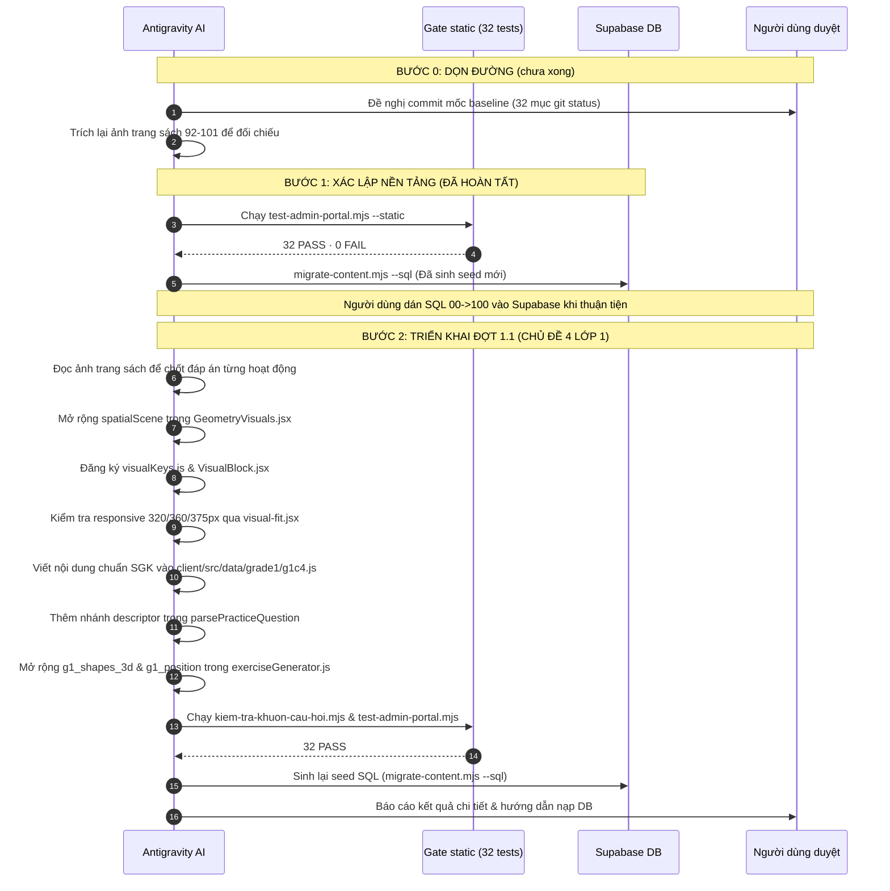

# Kế hoạch chuẩn hóa toàn diện: Tích hợp Khám phá, Hoạt động, Luyện tập chuẩn SGK vào Hệ thống Bài học & Luyện tập

**Ngày cập nhật:** 2026-09-24
**Tài liệu nguồn:** Toàn bộ file PDF và OCR Markdown trong thư mục `docs/Data Source/` (Bộ sách _Kết nối tri thức với cuộc sống_, Nhà xuất bản Giáo dục Việt Nam)
**Tình trạng kiểm soát chất lượng (Quality Gate):** `32 PASS · 0 FAIL · 0 SKIP` (đo lại ngày 2026-09-24)
**Trạng thái kế hoạch:** đã gộp bản hiệu chỉnh 2026-09-24 (đính chính nội dung SGK + ghi chú kỹ thuật + danh mục nguồn đáp án). **Đợt 1.1 (Chủ đề 4 Lớp 1) đã xong** — xem §8. **Đợt 2 = rà soát TOÀN BỘ Lớp 1 theo ảnh scan; Đợt 3–6 = Lớp 2 → 5** — xem §9 và §10.

---

## 1. Trạng thái 3 việc chặn (Đã xử lý hoàn tất trước Đợt 1.1)

| Hạng mục chặn                 | Hiện trạng trước xử lý                                                                                                                                                                                                                                             | Giải pháp & Kết quả đã thực hiện                                                                                                                                                                                                                                                                                                                                                                                                                                                                                                                                                                                                                                                 |
| :---------------------------- | :----------------------------------------------------------------------------------------------------------------------------------------------------------------------------------------------------------------------------------------------------------------- | :------------------------------------------------------------------------------------------------------------------------------------------------------------------------------------------------------------------------------------------------------------------------------------------------------------------------------------------------------------------------------------------------------------------------------------------------------------------------------------------------------------------------------------------------------------------------------------------------------------------------------------------------------------------------------- |
| **(a) Cổng kiểm tra tự động** | `28 PASS · 4 FAIL` (S-15, S-23, S-24, S-32) — **cùng một nguyên nhân duy nhất**: import ESM thiếu đuôi `.js` trong 5 file `gradeNData.js` nên **Node không nạp được dữ liệu** (Vite vẫn build được nên app không báo gì). Kèm theo, dữ liệu Lớp 1 đang bị rút gọn. | **ĐÃ XỬ LÝ:**<br>1. Thêm đuôi `.js` vào toàn bộ **51 dòng import** trong 5 file `gradeNData.js`.<br>2. Phục hồi đầy đủ Lớp 1: **10 chương · 97 bài · 541 slide** trong `client/src/data/grade1/g1c1.js` … `g1c10.js`. Tập `id` khớp hệt bản HEAD (**97/97, `Compare-Object` rỗng**) nên **không mất tiến độ của bé**.<br>3. Việc **riêng, KHÔNG phải nguyên nhân của 4 cổng đỏ**: bổ sung khai báo `mangObject` (`items`, `planeShapes`) trong `admin/src/lib/contentSchema.js` cho `story`, `concept`, `quiz` — để trình sửa bài biết đó là **mảng chứa object** (sửa bằng JSON) chứ không phải mảng chuỗi.<br>$\rightarrow$ **Kết quả:** `32 PASS · 0 FAIL · 0 SKIP` (exit 0). |
| **(b) Dấu vân tay Seed SQL**  | Cũ so với file tĩnh (`57bbb7365244e8c4 ≠ a84c634770b627c2`), S-32 đỏ.                                                                                                                                                                                              | **ĐÃ XỬ LÝ:** chạy `node scripts/migrate-content.mjs --sql`, sinh lại toàn bộ seed trong `supabase/content-seed/` và cập nhật `.dau-van-tay.json`. Đã kiểm seed **chứa bài mới** (`g1-c4-l7`). S-32 chuyển XANH.                                                                                                                                                                                                                                                                                                                                                                                                                                                                 |
| **(c) Vệ sinh Git Baseline**  | 5 file `.bak`, nhiều script thử nghiệm và ảnh scan SGK (~2.6 MB) nằm rải rác.                                                                                                                                                                                      | **ĐÃ XỬ LÝ:** xoá `.bak` (còn **0**) và script rác; `.gitignore` chặn `scripts/sgk_g1_p*.png`, `scripts/page_*.png`, `scripts/g1c*.png`, `scripts/slide_*.png`, `scratch/*.png`.<br>**CÒN TỒN:** baseline **chưa commit** (32 mục `git status`, còn `package-lock.json` và `scratch/pet-backup-2026-09-23.json`) — xem §1.2.                                                                                                                                                                                                                                                                                                                                                     |

### 1.1. Số đo xác nhận (đo lại độc lập ngày 2026-09-24)

| Hạng mục                   | Số đo thật                                   | Ý nghĩa                           |
| :------------------------- | :------------------------------------------- | :-------------------------------- |
| Cổng tĩnh                  | `32 PASS · 0 FAIL · 0 SKIP`, exit 0          | Cổng chạy được trở lại            |
| Import `gradeNData.js`     | 51/51 dòng có đuôi `.js`                     | Node nạp được dữ liệu             |
| Quy mô Lớp 1               | **10 chương · 97 bài · 662 slide**           | (Đợt 1.1: CĐ4 · Đợt 2: CĐ1 + CĐ2) |
| Quy mô toàn hệ thống       | **5 lớp · 51 chương · 459 bài · 2684 slide** | Khớp `MONG_DOI` (sau đợt rà CĐ2)  |
| Tập `id` Lớp 1             | 97/97, `Compare-Object` với HEAD rỗng        | Không đổi id ⇒ an toàn tiến độ    |
| Chương `g1-c4` SAU Đợt 1.1 | **7 bài · 68 slide** (7+7+10+11+9+11+13)     | Từ 39 slide cũ                    |
| Nội dung trong DB          | **chưa nạp** (mới chỉ có ở file tĩnh + seed) | Còn phải dán seed                 |

### 1.2. Việc còn tồn phải làm trước khi viết code

1. **Commit mốc baseline** (chỉ làm khi người dùng yêu cầu) để có đường lùi an toàn.
2. **Trích lại ảnh trang sách** cần đối chiếu — bản cũ đã bị xoá khỏi đĩa cùng đợt dọn dẹp (lệnh ở §5.2).
3. Sau khi viết nội dung: `--sql` → dán seed `00 → 01 … 06 → 99 → 100` → `--verify`.

---

## 2. Mục tiêu & Nguyên tắc kiến trúc sư phạm chuẩn SGK

### 2.1. Cấu trúc 3 trụ cột SGK qua Schema hệ thống

Hệ thống hiện tại quản lý chặt chẽ 5 kiểu slide cơ bản (`story`, `concept`, `visual`, `quiz`, `summary`). Tuyệt đối không tự ý thêm kiểu slide mới (sẽ bị Gate S-26 và form Admin chặn). Ba trụ cột SGK được chuẩn hóa thông qua trường `badge` và trình tự slide:

1. **Khám phá (Discovery):** Bắt đầu bằng slide `story` (tình huống đời thực do Mascot dẫn dắt) hoặc slide `concept` mang `badge: "Khám Phá"` (nhận biết kiến thức mới qua hình ảnh trực quan).
2. **Hoạt động (Guided Activities):** Slide `concept` hoặc `visual` mang `badge: "Hoạt Động"` hoặc `badge: "Thực Hành"`, kèm các bài tập nhận biết, thao tác ghép/nối hình học.
3. **Luyện tập (Practice & Deepening):** Các slide `quiz` mang `badge: "Luyện Tập"` hoặc thử thách đếm khối, tìm quy luật không gian có phản hồi mascot.
4. **Ghi nhớ (Summary):** Slide `summary` chốt lại quy tắc cốt lõi của bài học.

### 2.2. Quy ước đánh số bài học & quy mô hệ thống

- **Đánh số bài học:** Tuân thủ tuyệt đối quy ước đánh số theo chương (`Bài 1, Bài 2, ...`) để đảm bảo tính nhất quán với công cụ `scratch/chuan-hoa-danh-so.mjs` và hệ thống định tuyến `g{grade}-c{chapter}-l{lesson}`. Số hiệu bài SGK gốc được ghi rõ trong trường `description` (Ví dụ: `description: "SGK Bài 14 (tr.92–95): Nhận biết khối lập phương, khối hộp chữ nhật"`). **Không đổi `id` của bài đã có.**
- **Quy mô nội dung:** quy mô hiện tại là `5 lớp · 51 chương · 459 bài · 2671 slide` (Lớp 1: **10 chương · 97 bài · 649 slide**). Đợt 1.1 viết lại Chủ đề 4 (39 → **68 slide**), Đợt 2 viết lại Chủ đề 1 (67 → **128 slide**); các đợt sau viết lại từng chương nên **số slide sẽ tiếp tục đổi** — không thể "bảo toàn" một cách máy móc. Mỗi lần đổi, phải sửa đồng bộ **7 chỗ ghi cứng**:
  1. `scripts/migrate-content.mjs` — `MONG_DOI` + chuỗi `"khớp số đã đo (…)"`
  2. `scripts/migrate-content.mjs` — câu in cuối về thứ tự dán file
  3. `scripts/test-admin-portal.mjs` — `S-15` (2 câu), `S-23`, `S-24` + chuỗi thông báo
  4. `docs/admin_portal_test_cases.md` — dòng "Quy mô nội dung hiện tại"
  5. `docs/curriculum_audit.md` — 2 chỗ
  6. `docs/content_reload_steps.md`
  7. `supabase/content-seed/100-tang-phien-ban-sau-bo-sung.sql` (file **viết tay**, script không sinh lại)

  Mẹo: chạy cổng trước, **đọc con số thật trong thông báo lỗi** rồi mới sửa, đừng tự tính.

---

## 3. Tiêu chuẩn Đồ họa SVG & Thiết kế Responsive (Kế thừa `lesson_visuals_plan.md`)

Mọi thành phần đồ họa trực quan SVG mới đều phải tuân thủ nghiêm ngặt các quy tắc đã được đúc kết từ 7 vòng nghiệm thu thực tế:

1. **Khung nhìn chuẩn:** `viewBox <= ~380` (tối ưu hóa cho màn hình di động hẹp từ 320px đến 375px).
2. **Cỡ chữ:** mọi nhãn chữ trong SVG phải đạt **$\ge 14$ đơn vị `viewBox`** — tương đương **≈ 11 px** khi hiển thị ở màn 375 px (9,7 px ở 360 px; 7,2 px ở 320 px). Lưu ý đây là **đơn vị `viewBox`, KHÔNG phải "14 px trên màn hình"**; hiểu sai đơn vị thì gần như không đạt được trên điện thoại.
3. **Bọc responsive:** Sử dụng tiện ích `svgFit` sẵn có, tuyệt đối **CẤM** đặt `minWidth` cứng trên thẻ chứa bao ngoài khiến trang bị cuộn ngang.
4. **Bố cục đa khối:** Các bảng biểu, hàng cột nhiều phần tử phải sử dụng hàm tiện ích `chiaKhoi()` để tự động ngắt dòng/chia tỉ lệ.
5. **Kiểm thử giao diện không lỗi:** Trước khi xuất bản, toàn bộ hình vẽ phải được kiểm chứng qua `scratch/visual-fit.jsx` trên 3 độ phân giải tiêu chuẩn: `375px`, `360px`, `320px` (đảm bảo: 0 cuộn ngang, 0 tràn khung, 0 đè chữ).

---

## 4. Chi tiết triển khai Đợt 1.1: Lớp 1 — Chủ đề 4 (Làm quen với một số hình khối)

_Nguồn ngữ liệu đối chiếu:_ SGK **tr.92–101** trong `docs/Data Source/Grade 1/Math grade 1 part 1.pdf`. Ảnh trang đã trích ở 170–300 DPI nằm tại `scratch/kiem-tra-t95.png`, `scratch/kiem-tra-t98.png`, `t100`, `t101`, `t102` — quy ước **`t{N}` = trang PDF N = trang sách N−1**. Cách trích lại: xem §5.2.

### 4.1. Mở rộng component `spatialScene` trong `GeometryVisuals.jsx`

Thay vì tạo nhiều component rời rạc làm phình to bundle, toàn bộ cảnh không gian của Chủ đề 4 được tích hợp vào component hợp nhất `SpatialScene` (`GeometryVisuals.jsx`), đăng ký khóa nhận diện tại `visualKeys.js` và `VisualBlock.jsx`.

Các chế độ hiển thị (`mode`) mới gồm:

1. **`dollCatTable` (Búp bê trên bàn, mèo dưới gầm bàn — SGK tr.96):**
   - Mặt bàn gỗ 3D có độ dày, 4 chân bàn, bóng đổ sàn.
   - Búp bê ngồi ở **TRÊN** mặt bàn. Mèo vàng nằm ngủ ở **DƯỚI** gầm bàn.
2. **`rabbitQueue` (3 chú thỏ nhặt cà rốt — SGK tr.96):**
   - Thỏ nâu ở **TRƯỚC**, Thỏ khoang ở **GIỮA**, Thỏ xám ở **SAU**, hướng về củ cà rốt.
3. **`rabbitTurtleLeftRight` + `kidsLeftRight` (Trái – Phải — SGK tr.98):**

   SGK tr.98 in **hai hình tách biệt**, không phải một hàng 5 nhân vật:
   - **`rabbitTurtleLeftRight`:** Thỏ ở bên trái, Rùa ở bên phải. Câu hỏi: _"Bên trái là con gì?"_ (**thỏ**), _"Bên phải là con gì?"_ (**rùa**).
   - **`kidsLeftRight`:** hàng ngang **Mai – Nam – Rô-bốt** đúng thứ tự in (_"Từ trái sang phải: thứ nhất là Mai, thứ hai là Nam và thứ ba là Rô-bốt"_). Câu hỏi: _"Bên trái bạn Nam là ai?"_ (**Mai**), _"Bên phải bạn Nam là ai?"_ (**Rô-bốt**), _"Từ trái sang phải, bạn thứ ba là ai?"_ (**Rô-bốt**).
   - **ĐÍNH CHÍNH:** bản trước ghi một hàng "Rô-bốt, Nam, Mai, Rùa, Thỏ" — vừa **đảo ngược thứ tự** vừa **trộn hai hình** (Rùa thuộc hình đôi với Thỏ, không nằm trong hàng các bạn). Nếu vẽ theo bản cũ, câu hỏi sẽ ra **đáp án ngược SGK**.
   - Tr.98 còn **2 hoạt động nữa** cần đưa vào Bài 5: _"Bên phải là khối hình nào, bên trái là khối hình nào?"_ và một bài về **thứ tự hình phẳng** (vị trí thứ mấy từ trái sang phải / từ phải sang trái / hình nào ở giữa). Trang 99 có bài tương tự với **4 hình**.
   - Khi viết bài, **đọc `scratch/kiem-tra-t98.png` và `scratch/kiem-tra-t100.png`** để lấy đúng số hình, đúng màu và đúng đáp án — **đừng suy từ OCR** (OCR sai dấu thanh và sai thứ tự).

4. **`trainCars` (Đoàn tàu hỏa 4 toa — SGK tr.96–97):**
   - Đầu máy kéo 4 toa hàng đánh số 1, 2, 3, 4. Hỗ trợ chế độ quiz ẩn số toa bằng dấu `?`.
5. **`trafficLight` (Cột đèn giao thông 3 màu — SGK tr.96–97):**
   - Đèn tròn Đỏ (trên cùng), Vàng (ở giữa), Xanh lá (dưới cùng).
6. **`maisCastle` (Lâu đài khối gỗ của bạn Mai — SGK tr.94):**
   - **Hàng nền:** **5 khối lập phương** — Vàng – Xanh – Vàng – Xanh – Vàng.
   - **Hàng giữa:** **2 khối hộp chữ nhật màu đỏ** nằm ngang.
   - **Tầng trên:** **1 khối hộp chữ nhật màu vàng** nằm ngang.
   - **Đỉnh mái:** 1 khối lăng trụ tam giác màu đỏ (không phải khối lập phương, không phải khối hộp chữ nhật).
   - Tổng cộng **9 khối gỗ**.
   - **Đáp án chốt (người dùng xác nhận 2026-09-24):**
     - _"Có bao nhiêu khối lập phương?"_ $\rightarrow$ **5** (5 khối hàng nền).
     - _"Có bao nhiêu khối hộp chữ nhật màu đỏ?"_ $\rightarrow$ **2** (2 khối đỏ hàng giữa).
   - **ĐÍNH CHÍNH:** bản trước ghi "3 khối hộp chữ nhật vàng và 2 khối lập phương xanh" với đáp án câu 1 là **2** — **cả hai vế đều sai**.
   - **Yêu cầu bắt buộc khi vẽ:** 5 khối hàng nền phải **vuông rõ ở mặt trước**; khối đỏ và khối vàng tầng trên phải **thuôn dài rõ** (tỉ lệ ≥ 1,6 : 1). Đây là câu hỏi dạy đúng khái niệm trọng tâm của bài — **hình phải nhìn là phân biệt được, không cần đo**.
7. **`lettersTHC` (Chữ cái xếp bằng khối lập phương nhỏ — SGK tr.94):**
   - Vẽ đẳng cự 3D: Chữ **T** (5 khối), Chữ **H** (7 khối), Chữ **C** (5 khối).
   - **Đáp án:**
     - Chữ xếp bởi nhiều khối nhất: **Chữ H** (7 khối).
     - Hai chữ xếp bởi số khối bằng nhau: **Chữ T và Chữ C** (đều 5 khối).
8. **`cubeComposite2x2` (Ghép khối nhỏ thành khối lớn — SGK tr.100–101):**
   - Minh họa trực quan: 8 khối lập phương nhỏ $1 \times 1 \times 1$ ghép khít thành 1 khối lập phương lớn $2 \times 2 \times 2$.
9. **`patternSequence` — HOẠT ĐỘNG BỔ SUNG, KHÔNG thuộc SGK tr.101 (đính chính):**
   - Kiểm ảnh tr.100–101: Bài 16 "Luyện tập chung" **không có** bài chuỗi quy luật hình khối và **không có** chuỗi màu sắc.
   - Dạng _"hình thích hợp đặt vào dấu ?"_ **có thật**, nhưng nằm ở **Bài 19 "Ôn tập hình học" (tr.110)** — một bài khác, không thuộc Chủ đề 4.
   - Nội dung vẫn hữu ích: Chuỗi hình khối (Hộp chữ nhật đứng $\rightarrow$ Lập phương $\rightarrow$ Hộp chữ nhật $\rightarrow$ **[?]** $\rightarrow$ Lập phương) và chuỗi màu sắc (Đỏ $\rightarrow$ Vàng $\rightarrow$ Xanh $\rightarrow$ Đỏ $\rightarrow$ Vàng $\rightarrow$ **[?]** $\rightarrow$ Xanh).
   - $\Rightarrow$ Hoặc bỏ, hoặc giữ nhưng **ghi rõ trong `description` là "hoạt động bổ sung ngoài SGK"**. Tuyệt đối không ghi "SGK tr.101".

---

### 4.2. Cấu trúc bài học chi tiết trong `client/src/data/grade1/g1c4.js`

Chủ đề 4 gồm **7 bài** (giữ nguyên 7 bài và `id` hiện có của chương — đã đo: 39 slide):

- **Bài 1 (`g1-c4-l1`):** Khối lập phương _(SGK Bài 14, tr.92–93)_. Khám phá hộp quà, xúc xắc (xúc xắc có đủ 3 mặt nhìn thấy để hỏi được cả mặt trước / mặt trên / mặt bên phải).
- **Bài 2 (`g1-c4-l2`):** Khối hộp chữ nhật _(SGK Bài 14, tr.92–93)_. Khám phá hộp bánh, viên gạch, bao diêm; Hoạt động tìm khối hộp chữ nhật.
- **Bài 3 (`g1-c4-l3`):** Phân biệt khối lập phương và khối hộp chữ nhật _(SGK Bài 14, tr.94–95)_. Lâu đài bạn Mai (**5 khối lập phương** ở hàng nền); chữ cái T/H/C bằng khối lập phương nhỏ.
- **Bài 4 (`g1-c4-l4`):** Vị trí — Trên, Dưới, Trước, Sau _(SGK Bài 15, tr.96–97)_. Búp bê & Mèo quanh bàn; 3 chú thỏ chạy nhặt cà rốt; Toa tàu hỏa; Cột đèn giao thông.
- **Bài 5 (`g1-c4-l5`):** Vị trí — Trái, Phải _(SGK **Bài 15**, tr.98)_. Thỏ – Rùa; hàng **Mai – Nam – Rô-bốt**; thứ tự hình phẳng; Xác định tay trái, tay phải của bản thân.
- **Bài 6 (`g1-c4-l6`):** Định hướng trong không gian _(SGK **Bài 15**, tr.96–99)_. Vị trí đồ vật trong phòng học; phần luyện tập tr.99 (4 hình phẳng; khối lập phương A/B đổi màu mặt trước – trên – phải).
- **Bài 7 (`g1-c4-l7`):** Luyện tập chung chủ đề 4 _(SGK **Bài 16**, tr.100–101)_. **4 hoạt động của SGK** (bảng dưới) + hoạt động bổ sung ngoài SGK.

Bốn hoạt động thật của SGK Bài 16 "Luyện tập chung" (tr.100–101):

| #   | Hoạt động SGK                                                                                                                                               | Trang  |
| :-- | :---------------------------------------------------------------------------------------------------------------------------------------------------------- | :----- |
| 1   | "Những hình nào là khối lập phương? Những hình nào là khối hộp chữ nhật?" (bộ hình **A, B, C, D, E, G** — SGK vẽ 6 hình, có 1 khối trụ để bé phải loại trừ) | tr.100 |
| 2   | **Xúc xắc:** "a) Mặt trước xúc xắc có mấy chấm? b) Mặt bên phải xúc xắc có mấy chấm? c) Mặt trên xúc xắc có mấy chấm?"                                      | tr.100 |
| 3   | "Câu nào đúng?" — so sánh số khối lập phương nhỏ của hai hình                                                                                               | tr.101 |
| 4   | "Từ 8 khối lập phương nhỏ như nhau, em hãy xếp thành một khối lập phương lớn."                                                                              | tr.101 |

Hoạt động **2** và **3 đang bị thiếu** trong bản trước (bản kế hoạch đầu tiên có xúc xắc, bản hiệu chỉnh trước đã bỏ mất). Đáp án của hoạt động 3 phải chốt theo ảnh `scratch/kiem-tra-t102.png` — hình có khối bị che nên phải đếm kỹ.

**Cách ghi nguồn:** dùng **số trang** ("SGK Bài 14, tr.92–95") thay cho "Tiết 1/2/3" — sách in 2 trang đôi (92–93 và 94–95) và không có nhãn "tiết".

Mỗi bài học đều chứa đầy đủ cấu trúc: `story` mở đầu $\rightarrow$ `concept` (Khám Phá) $\rightarrow$ `concept/visual` (Hoạt Động / Thực Hành) $\rightarrow$ `quiz` (Luyện Tập) $\rightarrow$ `summary` (Ghi Nhớ).

---

### 4.3. Mở rộng Hệ thống Luyện tập (`PracticePage` & `exerciseGenerator.js`)

1. **Mở rộng chủ đề có sẵn thay vì tạo mới:**
   - Sử dụng 2 chủ đề đã có trong `TOPICS`: `g1_shapes_3d` (Khối 3D) và `g1_position` (Vị trí không gian).
   - Bổ sung **cả 2** chủ đề này vào danh sách tổng hợp của `g1_final_review` (hiện tại đang thiếu).
2. **Khuôn câu hỏi phong phú chuẩn SGK:**
   - Câu hỏi nhận biết khối lập phương / khối hộp chữ nhật.
   - Câu hỏi đếm khối lâu đài bạn Mai (đáp án **5** khối lập phương), đếm khối chữ cái T/H/C.
   - Câu hỏi xác định vị trí đoàn tàu hỏa (toa trước, toa sau, toa ở giữa).
   - Câu hỏi cột đèn giao thông (vị trí màu đèn).
   - Câu hỏi xác định vị trí hàng ngang các bạn (trái, phải).
   - Câu hỏi tìm hình tiếp theo trong chuỗi quy luật _(hoạt động bổ sung, không thuộc SGK Chủ đề 4)_.
3. **Tối ưu hóa Payload lưu trữ `child_mistakes` — kèm thay đổi BẮT BUỘC ở `PracticePage`:**
   - Lý do bắt buộc: `parsePracticeQuestion` trong `client/src/pages/PracticePage.jsx` hiện render `visualDisplay` **thẳng như một React node** khi nó không phải chuỗi $\Rightarrow$ đưa object descriptor vào sẽ làm React ném _"Objects are not valid as a React child"_.
   - $\Rightarrow$ Phải thêm nhánh **nhận diện descriptor $\rightarrow$ render component tương ứng**. Đây không phải "tối ưu tùy chọn" mà là **thay đổi bắt buộc**.
   - Khi lưu câu sai vào `visual_display` (jsonb), truyền descriptor gọn nhẹ thay vì cây JSX: `{ kind: 'spatialScene', mode: 'trainCars', params: { targetCar: 2 } }`.
   - **Lợi ích phụ — vá một lỗi tiềm ẩn:** `useProgressStore` đang `persist` **cả** `mistakesQueue` (không có `partialize`); với 9 khuôn hình hiện tại, `visualDisplay` là React element nên khi zustand ghi vào `localStorage` nó bị `JSON.stringify` thành **object thường**; đọc lại sau khi tải lại trang rồi đưa vào React là hỏng. Descriptor + hàm render dứt điểm nhóm lỗi này.
4. **Kiểm thử tự động khuôn câu hỏi:**
   - Chạy `node scratch/kiem-tra-khuon-cau-hoi.mjs` để đảm bảo 100% template câu hỏi sinh ra đáp án hợp lệ, `mascotHint` chuẩn xác và không lỗi cú pháp.

---

## 5. Phương pháp khai thác tài liệu SGK cho Giai đoạn 2 (Lớp 2 – 5)

1. **Bản chất tài liệu nguồn:** Toàn bộ 8 file PDF SGK trong `docs/Data Source/` là **bản quét hình ảnh (Scan Image, 0 text layer)**. Thư viện PyMuPDF không thể bóc tách text trực tiếp từ PDF.
2. **Quy trình kết hợp 2 nguồn dữ liệu:**
   - **Trích ảnh trang bằng PyMuPDF.** Công cụ đang có trong repo là **`scripts/ocr-textbook-pdfs.py`** (xuất PNG xám 300 DPI kèm ghi `.md`). Lệnh trích nhanh một trang:

     `python -c "import pymupdf;d=pymupdf.open('<đường-dẫn-pdf>');d[i].get_pixmap(dpi=300).save('scratch/x.png')"`

     với **`i` = số trang sách** (PDF có 1 trang bìa ở đầu nên trang PDF N = trang sách N−1, mà chỉ số lại 0-based $\Rightarrow$ hai độ lệch triệt tiêu nhau. Đã kiểm: `d[98]` cho đúng trang "Phải – Trái", `d[94]` cho đúng hình bạn Mai).

   - **Lấy ngữ liệu chữ** từ các file OCR Markdown sẵn có (`docs/Data Source/**/*.md`).
   - **Lưu ý:** ảnh SGK trên đĩa **đã bị xoá** cùng đợt dọn rác (`.gitignore` đã chặn) $\Rightarrow$ cần đối chiếu thì phải **trích lại**.
   - **Bảng ánh xạ (Mapping Table)** `trang_sach -> bai_hoc` phải dựng trước khi thực hiện.

---

## 6. Trình tự thực hiện & Nghiệm thu (Action Plan)



---

## 7. Nguồn của từng đáp án và số liệu (để lần sau không phải đoán lại)

| Nội dung                                                                                                                                                | Nguồn                                                                                                     |
| :------------------------------------------------------------------------------------------------------------------------------------------------------ | :-------------------------------------------------------------------------------------------------------- |
| Cổng `32 PASS · 0 FAIL`; Lớp 1 = 97 bài / 662 slide; tổng 5 · 51 · 459 · 2684; `id` khớp HEAD 97/97                                                     | Đo trực tiếp ngày 2026-09-24 (cập nhật sau vòng tách hình — §8i)                                          |
| Hình bạn Mai: hàng nền **5 khối lập phương**, **2** khối hộp chữ nhật đỏ                                                                                | **Người dùng chốt 2026-09-24** (đối chiếu SGK tr.94)                                                      |
| Chữ T = 5, H = 7, C = 5 → H nhiều nhất, T = C                                                                                                           | Đếm lại trên ảnh phóng to (trang sách 94)                                                                 |
| Thứ tự **Mai – Nam – Rô-bốt**; đôi **Thỏ – Rùa**                                                                                                        | Chữ in trên SGK tr.98 (`scratch/kiem-tra-t98.png`)                                                        |
| Bài 15 = tr.96–99; Bài 16 "Luyện tập chung" = tr.100–101                                                                                                | Mục lục SGK (trang mục lục, bản OCR)                                                                      |
| Bài 16 có xúc xắc + "Câu nào đúng?" + 8 khối                                                                                                            | `scratch/kiem-tra-t101.png`, `t102.png` + OCR                                                             |
| Tr.100–101 **không có** chuỗi quy luật / chuỗi màu                                                                                                      | Ảnh 2 trang đó                                                                                            |
| Hai hàng bạn xem ti vi (tr.97): hàng sau **6 bạn** + hàng trước **4 bạn** = **10 bạn**                                                                  | **Người dùng đếm trên SÁCH GIẤY 2026-09-24** — ảnh quét tr.97 mờ, KHÔNG đếm được trên scan                |
| Ba hàng gạch (tr.97): 2 + 3 + 4 = **9 viên**                                                                                                            | Đếm trên ảnh crop tr.97                                                                                   |
| Tr.99: hàng **4 hình phẳng** (tam giác · vuông · tròn · chữ nhật); khối A (trước đỏ – trên xanh – phải vàng), khối B (trước xanh – trên vàng – phải đỏ) | Ảnh `scratch/kiem-tra-t100.png` — tệp này ĐÚNG là trang sách 99                                           |
| Tr.100: **A, C, E** = khối lập phương · **B, G** = khối hộp chữ nhật · **D** = khối trụ                                                                 | Đo mặt trước trên ảnh 300 DPI (`scratch/in-khoi-abcg.py`): A 105×105 · E 168×159 · B cao hơn rộng · G dài |
| Tr.100 xúc xắc: mặt trước **5** chấm · mặt bên phải **6** chấm · mặt trên **3** chấm                                                                    | Đo `scratch/crop-xucxac.png`; khớp quy luật xúc xắc thật (5+2 = 3+4 = 6+1 = 7)                            |
| Tr.101: hình trái **8 khối** · hình phải **4×2 = 8 khối** ⇒ "Hai hình có số khối bằng nhau" (đáp án b)                                                  | Đếm từng mặt trên ảnh `scratch/kiem-tra-t102.png` — tệp này ĐÚNG là trang sách 101                        |

| Chủ đề 1 L1 — bảng Khám phá bể cá (0→5) và ong/chim/hoa/sao biển/bọ rùa (6→10) | Ảnh tr.8, tr.14 (số lượng theo sách) |
| Chủ đề 1 L1 — cà rốt tô màu [0,2,4] ⇒ **3 củ** | **AI chọn** (SGK tr.11 không đếm được trên scan) |
| Chủ đề 1 L1 — đàn gà ghi số [1,4,5,2,2,1,2,3,0] ⇒ có **3 con ghi số 2** | **AI chọn** (SGK tr.11) |
| Chủ đề 1 L1 — 5 con vật, 1 con nhện 8 chân ⇒ **4 con có 6 chân** | **AI chọn** (SGK tr.17) |
| Chủ đề 1 L1 — số vật trong 4 tranh cảnh: nông trại (bò 2 · gà 4 · hướng dương 5 · mây 3 · mặt trời 1 · cá 6) · ao (thỏ 4 · cây 3 · vịt 5 · mây 2 · chim 6) · bến sông (thuyền 3 · dừa 4 · nhà 2 · cá 5) · cánh đồng (trâu 5 · nhà 3 · lúa 6 · mặt trời 1 · mây 2) | **AI chọn** (SGK tr.13, 17, 39, 40) |
| Chủ đề 1 L1 — cho thêm để đủ: trứng 5→8 (A2/B3) · bánh 4→6 (A1/B2) · thùng 1→3 (A1/B2) · cà rốt 2→4 (A2/B3) | **AI chọn** (SGK tr.18, 15, 12, 23) |
| Chủ đề 1 L1 — mê cung số tr.25 (lưới 6×6, đường đi qua ô > 4) | **AI chọn** (SGK tr.25) |

**Quy ước tên tệp ảnh (đo lại 2026-09-24, trước đây ghi sai một nửa):** `scratch/kiem-tra-t{N}.png` = **trang sách N−1** (vì `kiem-tra-t100.png` in số trang 99). `scratch/sgk-t{N}.png` là **cùng tệp đó** với tên khác (`sgk-t99.png` = `kiem-tra-t100.png`). ⇒ Muốn xem trang sách P thì mở `kiem-tra-t{P+1}.png`, hoặc trích mới bằng `d[P]` như §5.2.

**Ghi chú về thước đo (đã mắc, ghi lại để đừng lặp):** đã thử đo tự động tỉ lệ/màu trong ảnh 300 DPI bằng ngưỡng RGB để phân biệt khối lập phương với khối hộp chữ nhật của hình bạn Mai — phép đo cho **hai kết quả mâu thuẫn trên cùng một điểm ảnh** nên **đã bỏ**, chỉ dùng mắt trên ảnh phóng to cộng với đáp án người dùng chốt. (Số đo vô lý thì nghi cây thước trước, đừng nghi dữ liệu.)

---

## 8. Kết quả Đợt 1.1 (Chủ đề 4 Lớp 1 — đã xong 2026-09-24, CHƯA đẩy)

| Hạng mục            | Kết quả                                                                                                                                                                                                                                                                            |
| :------------------ | :--------------------------------------------------------------------------------------------------------------------------------------------------------------------------------------------------------------------------------------------------------------------------------- |
| Nội dung            | 7 bài viết lại theo SGK tr.92–101: **39 → 68 slide**, **24 lượt hình**, bài nào cũng có hình                                                                                                                                                                                       |
| Hình vẽ             | 20 cảnh trong `SpatialScene`; thêm 4 mode mới: `movieRows` · `brickRows` · `diceFaces` · `cubeWalls`; `solidSort` vẽ lại theo **bộ A–G thật** của SGK tr.100 (bản cũ vẽ 4 hình A/B/C/D theo phỏng đoán — đã bỏ)                                                                    |
| Đáp án              | Xem bảng §7 — điểm đã từng sai: hai hàng bạn là **6 + 4 = 10** (không phải 5 + 4)                                                                                                                                                                                                  |
| Luyện tập           | `g1_shapes_3d` 4 → **13 khuôn** · `g1_position` 5 → **13 khuôn**, phần lớn kèm hình; cả hai đã vào **Ôn tập cuối năm Lớp 1**; thêm `client/src/components/common/QuestionVisual.jsx` để hình lưu trong câu sai vẫn dựng lại được (vá lỗi "Objects are not valid as a React child") |
| Bằng chứng          | Build sạch · **32/32 cổng** · 79 khuôn câu hỏi, 0 hỏng, 2580 câu sinh thử · **375/360/320 px: 0 tràn ngang, 0 tràn viewBox, 0 chữ chồng** · `--verify` lệch **đúng 7 bài** g1-c4-l1…l7 (vì DB còn bản cũ)                                                                          |
| Số liệu đã cập nhật | 2455 → **2545 slide** ở 7 chỗ ghi cứng; seed sinh lại (`02-bai-lop-1.sql` + `100-tang-phien-ban-sau-bo-sung.sql` là 2 tệp cần dán)                                                                                                                                                 |
| **Chưa làm**        | **Chưa commit, chưa push, chưa dán seed** — người dùng test local trước (2026-09-25)                                                                                                                                                                                               |

---

## 8b. Đợt 2 — Chương 1 Lớp 1 (SGK tr.6–45): ĐÃ XONG 2026-09-24, CHƯA đẩy

Bảng phát hiện đầy đủ: **`docs/sgk_audit_lop1.md`** (16 phát hiện nhóm A · 3 nhóm B · 4 nhóm C · 3 nhóm D · 0 nhóm E).

**Đã làm:**

| Hạng mục                                          | Kết quả                                                                                                                                                                                                                                                                                                                                                                                                                                                                   |
| :------------------------------------------------ | :------------------------------------------------------------------------------------------------------------------------------------------------------------------------------------------------------------------------------------------------------------------------------------------------------------------------------------------------------------------------------------------------------------------------------------------------------------------------ |
| Nội dung                                          | 12 bài viết lại theo đúng 7 bài của SGK: **67 → 128 slide**, **47 lượt hình**                                                                                                                                                                                                                                                                                                                                                                                             |
| **Chuyển đổi cho khớp sách (yêu cầu người dùng)** | Số 0 nay học **cùng nhóm 0–3** (tr.8) thay vì đứng riêng sau 6–10; bỏ dạy trước “5 > 4” ở bài số 4,5 (dấu so sánh để đúng bài 8); bài cuối ghi rõ là bài luyện tập chung **tiếp theo** của SGK tr.42–45                                                                                                                                                                                                                                                                   |
| Chữ đọc số                                        | Có: **“1 một · 2 hai · … · 10 mười”** trong bảng Khám phá và trong phần Ghi nhớ                                                                                                                                                                                                                                                                                                                                                                                           |
| Bộ hình mới                                       | `client/src/components/visuals/Grade1NumberVisuals.jsx` — khoá mới **`numberScene`**, **12 kiểu**: `fiveFriends` · `numberShow` (bể cá 0→5, ong/chim/hoa/sao biển/bọ rùa 6→10) · `manyGroups` (có GHÉP ĐÔI) · `addToReach` · `countFiltered` (tô màu / ghi số / đếm chân) · `sceneCount` (4 tranh cảnh) · `numberTrain` (dãy số, toa tàu) · `numberBond` (sơ đồ nhánh + bảng tách số) · `matchEqual` · `numberMaze` · `dotCards` (thẻ chấm kiểu xúc xắc) · `comparePairs` |
| **Bỏ theo yêu cầu người dùng**                    | **Không** làm “Tập viết số” (tr.9, 15) và **không** làm 2 trò chơi bàn cờ có xúc xắc (tr.19 “Nhặt trứng”, tr.43 “Cầu thang – Cầu trượt”)                                                                                                                                                                                                                                                                                                                                  |
| Bằng chứng                                        | 12 hình chạy sạch: **0 tràn thẻ, 0 tràn viewBox, 0 chữ chồng** ở 375/360/320 px; 128 slide **0 lỗi cấu trúc**; build sạch; cổng **32/32**                                                                                                                                                                                                                                                                                                                                 |

**Số liệu tự chọn** (ảnh scan không đủ rõ để đếm) — đã ghi vào bảng §7: cà rốt tô màu 3 củ · gà ghi số 2 là 3 con · 4 con vật 6 chân · số vật trong 4 tranh cảnh · các cặp “cho thêm” · lưới mê cung 6×6.

---

## 8c. Đợt 1.2 — Rà soát hình minh họa SAI KIẾN THỨC (`tenFrame` bị dùng sai) — xong 2026-09-24, CHƯA đẩy

**Người dùng phát hiện (lớp 2, nhìn hình thật trên app):** hình cua “7 con × 2 càng” lại vẽ 14 con cua; “3 khay × 2 quả” lại vẽ 10 ô rời; hình gộp 10 (6+4) tô **cùng một màu** nên trẻ không thấy chỗ “gộp đủ 10”.

**Nguyên nhân gốc:** `tenFrame` (khung 2×5) bị dùng như “khung vẽ chung” cho mọi bài, trong khi công dụng duy nhất của nó là **đếm cho đầy 10**. Kết quả rà soát 7 chỗ dùng: **không chỗ nào** là bài học “đếm cho đầy 10”.

| Chỗ dùng cũ                                | Vẽ ra gì (sai)                                      | Thay bằng (đúng)                                                                                |
| :----------------------------------------- | :-------------------------------------------------- | :---------------------------------------------------------------------------------------------- |
| g1-c3-l1 (3 + 2 = 5)                       | 2 khung 10 ô, không nói được phép cộng              | `groupScene` · `sumGroups` 3 quả + 2 quả ⇒ 5                                                    |
| g1-c3-l5 (6 − 2)                           | đủ 6 ô nhưng **không có ô nào bị gạch** ⇒ không bớt | `groupScene` · `takeAway` 6 kẹo, gạch X 2 cái, còn ?                                            |
| g2-c2-l1 / l2 / l4 (gộp 10: 9+4, 8+5, 6+7) | một màu duy nhất ⇒ không thấy “6 + 4 gộp thành 10”  | `groupScene` · `makeTen` (a xanh + b vàng nét đứt “thêm b” + c xanh còn lại + 2 dòng đẳng thức) |
| g2-c8-l1 (3 khay × 2 quả)                  | 6 ô rời, không thành 3 khay                         | `groupScene` · `equalGroups` kind `trays`, n=3 k=2                                              |
| g2-c8-l6 (7 cua × 2 càng)                  | 10 + 4 **con cua** ⇒ đọc thành 14 con cua           | `groupScene` · `equalGroups` kind `parts`, `partKind:"claw"`, n=7 k=2                           |

**Rà tiếp nhóm hình `items` (canh bạc thứ hai):** 97 chỗ dùng `items`; **16 chỗ** có lời dạy “mỗi … có k …” hoặc “chia đều cho/thành k …” nhưng hình chỉ vẽ **1 vật** ⇒ trẻ không có gì để đếm. Đã thay hết bằng hình nhóm:

- 3 bài “mỗi vật có k phần”: chim 5 × 2 cánh · xe đạp 3 × 3 bánh · ô tô 3 × 4 bánh · hộp 3 × 6 bút (`partKind: "wing" / "wheel" / "box"`).
- 12 bài “chia đều”: 10 cam→2 đĩa · 6 kẹo→2 bạn · 16 táo→2 đĩa · 18 kẹo→2 bạn · 12 kẹo→3 bạn · 18 kẹo→3 bạn · 20 bóng→4 rổ · 32 cam→4 đĩa · 35 cam→7 đĩa · 48 kẹo→8 túi (đều dùng `trays` + `hidePerGroup` + “đống” tổng ở dưới, khay ghi `?`), 45 bông hoa mỗi bó 5 (`unknownGroups`), 5 đĩa × 2 cam (hiện đủ 5 khay).
- 1 bài hình cột (lớp 4, TBC của 10/15/20) → dùng khoá **`barChart`** sẵn có.

**Bộ hình mới:** `client/src/components/visuals/GroupVisuals.jsx` — khoá **`groupScene`**, 5 kiểu: `sumGroups` · `takeAway` · `makeTen` · `equalGroups` (`kind:"trays"` hoặc `kind:"parts"`) · `unknownGroups`. Đăng ký ở `visualKeys.js` (`HINH_KEYS`) và `VisualBlock.jsx`. `tenFrame` **vẫn giữ** trong mã nguồn (là công cụ đúng cho bài “đếm cho đầy 10” sau này) nhưng **dữ liệu hiện dùng 0 lần**.

**Số liệu tự chọn** (giữ đúng tỉ lệ phép tính trong lời bài, không cần scan):

| Hình                         | Số tự chọn                                                                                                                       |
| :--------------------------- | :------------------------------------------------------------------------------------------------------------------------------- |
| Các bài “chia đều”           | n và k lấy **nguyên từ lời bài** (10:2, 6:2, 16:2, 18:2, 12:3, 18:3, 20:4, 32:4, 35:7, 48:8) — hình chỉ vẽ lại đúng phép chia đó |
| “Đống” tổng khi khay ghi `?` | vẽ tối đa **10 vật** + ghi rõ “Có <tổng> …” (đếm 48 vật là vô nghĩa với trẻ)                                                     |
| Bánh xe / cánh / càng / bút  | đúng k của lời bài; ô tô 4 bánh vẽ **4 bánh** (2 trên + 2 dưới), xe đạp 3 bánh vẽ 3                                              |

**Bằng chứng (đo trên hình THẬT của cả 5 lớp — `scratch/visual-fit.jsx` → 650 ca hình):**

| Phép đo                | 375 px | 360 px | 320 px |
| :--------------------- | :----- | :----- | :----- |
| Tràn khỏi thẻ nội dung | 0      | 0      | 0      |
| Tràn khỏi viewBox      | 0      | 0      | 0      |
| Chữ chồng nhau         | 0      | 0      | 0      |

- Bảng đo của khung in ra: **`tenFrame` = 0 ca** trong dữ liệu ⇒ rà soát đã phủ hết; **`groupScene` = 21 ca** khác nhau.
- Lỗi bắt được nhờ đo (build + 32 cổng vẫn xanh): **chữ thích dài tràn viewBox 8 đơn vị mỗi bên** ở 5 hình ⇒ đã thêm `Caption` **tự thu nhỏ cỡ chữ** (sàn 10) và rút gọn lời thích trong dữ liệu.
- Tổng số **không đổi**: 5 lớp · 51 chương · **459 bài · 2545 slide** (chỉ thay hình, không thêm/bớt slide). Cổng **32/32** xanh, seed đã sinh lại (dấu vân tay `ff80232e4ec8af61`).
- Tồn nhỏ **có sẵn từ trước, chưa đụng**: 3 hình khối lớp 5 (`solid`) có 2 chữ chồng nhau 9×5 px ở mọi bề rộng.

---

## 8d. Đợt 1.3 — Rà soát “hình vẽ nói KHÁC lời bài” trên TOÀN BỘ 5 lớp (xong 2026-09-24, CHƯA đẩy)

**Người dùng phát hiện:** `g1-c6-l10` dạy “thêm 10 thì **xuống 1 hàng**” nhưng hình lại là **tia số một hàng**, mũi tên `+10` chạy thẳng ⇒ hình tự mâu thuẫn với chính lời thích của nó.

**Cách rà (chạy lại được bất cứ lúc nào):**

```
node scratch/ra-hinh-nghi-ngo.mjs
```

Script soi **569 slide có hình** theo hai lớp kiểm:

1. **Luật theo lời bài** (13 luật): lời nhắc tới một loại hình cụ thể thì slide phải gắn đúng khoá hình đó — “xuống/lên một hàng” ⇒ phải là bảng lưới, không được là tia số; “tia số”; “bảng 100 số”; “biểu đồ tranh/cột”; “chia đều”; “mỗi … có k …”; “đo độ dài”; “mua bán”; hình phẳng; khối; phân số; so sánh.
2. **Luật cấu trúc** (hình tự nói về chính nó): `numberLine` — `from < to`, các nhãn `marks` tăng dần và nằm trong khoảng vẽ, **mọi mũi tên phải trỏ vào số CÓ NHÃN trên tia**; bảng — các hàng dài bằng nhau; `groupScene` khay — `n × k` phải bằng tổng ghi ở “đống”, mỗi khay tối đa 8 vật.

⚠️ Bài học khi viết luật: lời thích nằm **TRONG props của hình** (ví dụ `numberLine.label`) chứ không phải ở `content.text` — lần đầu chỉ soi `text` nên **bỏ lọt đúng ca người dùng báo**. Phải gom **mọi chuỗi** trong slide (đệ quy cả props). Và mũi tên đi ngược trên tia số là **hợp lệ** với bài bớt/trừ/làm tròn ⇒ luật phải đọc nhãn mũi tên trước khi kết luận.

**Kết quả rà soát (569 slide có hình):** **0 ca** còn nghi ngờ. Tìm được **2 lỗi thật**, đã sửa:

| Chỗ                          | Sai                                                                                | Đã sửa                                                                                                                                                                                                                                   |
| :--------------------------- | :--------------------------------------------------------------------------------- | :--------------------------------------------------------------------------------------------------------------------------------------------------------------------------------------------------------------------------------------- |
| `g1-c6-l10` (lớp 1, bài 10)  | Tia số 1 hàng mà lời dạy “thêm 10 thì XUỐNG 1 hàng” ⇒ không thể diễn tả được       | Bỏ `numberLine`, thêm **kiểu mới `gridWalk`** cho khoá `numberScene`: bảng 100 số 2 hàng × 10 cột, ô **25** xanh, **26** vàng có mũi tên **+1 sang phải**, **35** xanh có mũi tên **+10 xuống dưới**, kèm nét đứt nối mũi tên với đúng ô |
| `g3-c8-l7` (lớp 3, làm tròn) | Mũi tên `24 → 20` trỏ vào số **20 không có nhãn trên tia** (mới chỉ có 24, 25, 30) | Thêm nhãn **20** vào `marks`; đổi nhãn mũi tên thành `24 → 20` (nhãn cũ dài 21 ký tự **tràn viewBox 9 đơn vị** — đo mới thấy)                                                                                                            |

**Bằng chứng sau khi sửa:** rà soát **0 ca nghi ngờ**; đo hình thật 650 ca ở 375/360/320 px: **0 tràn thẻ · 0 tràn viewBox · 0 chữ chồng** (chỉ còn 3 hình `solid` lớp 5 chồng chữ 9×5 px có từ trước); build sạch; cổng **32/32**; seed sinh lại (dấu vân tay `e10f39fae05d9127`); tổng **không đổi** 51 chương · 459 bài · **2545 slide**.

### 8d-bis. Vòng 2 (cùng ngày) — bộ vẽ BỎ QUA mốc không nằm trên nhịp

Bạn báo tiếp: bài làm tròn đến hàng nghìn `g3-c11-l5` — **dữ liệu đúng** (`marks: [24 000, 24 300, 24 800, 25 000]`) mà **hình chỉ vẽ 24 000 và 25 000** ⇒ lời thích nói tới hai con số không hề có trên hình.

**Nguyên nhân gốc — lỗi của BỘ VẼ, không phải của dữ liệu:** `NumberLine` sinh mốc **chỉ theo `step`** (`for v = from; v <= to; v += step`), nên mốc nào không chia hết cho nhịp thì **bị bỏ qua im lặng** (cùng họ với bẫy `clamp` đã gặp ở `TenFrame`).

**Đã sửa (3 chỗ):**

| Chỗ                | Sửa                                                                                                                                   |
| :----------------- | :------------------------------------------------------------------------------------------------------------------------------------ |
| `CoreVisuals.jsx`  | `ticks` = mốc theo nhịp **∪ `marks`** rồi sắp lại ⇒ mọi mốc trong dữ liệu đều được vẽ                                                 |
| `CoreVisuals.jsx`  | Thêm `canRongCap`: bề rộng trục phải đủ cho **từng CẶP mốc sát nhau** (24 000 ✕ 24 300) — chỉ tính tổng như cũ thì hai nhãn dính nhau |
| `g2-c8-l2` (lớp 2) | Lời “2 được lấy 5 lần” mà hình chỉ vẽ **3 nhịp** ⇒ vẽ đủ **5 nhịp** (đánh số 1…5)                                                     |
| `g3-c1-l5` (lớp 3) | Nhãn hứa “đếm thêm 2 rồi đếm thêm 5” mà trục 2→18 chỉ đủ chỗ cho bảng nhân 2 ⇒ nhãn nói đúng điều hình vẽ                             |

**Cổng kiểm MỚI — và đây là bài học chính:** rà soát dữ liệu **không đủ**, vì dữ liệu đúng mà bộ vẽ bỏ qua thì mọi phép kiểm dữ liệu vẫn xanh. Phép kiểm phải **RENDER thật rồi đếm**: _mọi mốc trong `marks` phải có một `<text>` tương ứng trên SVG_. Đo 42 ca `numberLine`: **0 ca thiếu mốc** (trước khi sửa: ca `g3-c11-l5` thiếu 2 mốc).

**Số đo sau khi sửa:** 650 ca hình thật ở 375/360/320 px — **0 tràn thẻ · 0 tràn viewBox · 0 chữ chồng**; rà soát lời↔hình **0 ca nghi ngờ**; build sạch; cổng **32/32**; seed sinh lại (`ad044589ebc9c570`); tổng **không đổi** 51 chương · 459 bài · **2545 slide**. Đã xem ảnh chụp cả 3 hình vừa sửa (tia số làm tròn đủ 4 mốc; tia số 5 nhịp không chồng cung).

### 8d-ter. Vòng 3 (cùng ngày) — BẢNG HÀNG: ô không đều nhau, và số bị cắt hai dòng gây hiểu sai

Bạn báo 2 điều về hình `placeValue`:

1. **Số bị cắt làm hai dòng** (`g4-c1-l6`: 345 000 000 chia 5 ô + 4 ô) ⇒ trẻ không biết đang đọc **"345000000"** hay là hai số **"34500" và "0000"**.
2. **Chữ không đồng đều về khung và khoảng cách, to nhỏ khác nhau, nhìn rất xấu** (`g4-c1-l3`): đo được trong **cùng một bảng** có ô rộng **83**, ô rộng **50**, ô rộng **40**; hai khối còn khác nhau cả số dòng chữ.

**Nguyên nhân:** mỗi cột tự tính bề rộng theo tiêu đề của chính nó (`cotTuNhien[c]`), và mỗi KHỐI tự tính chiều cao hộp tiêu đề theo số dòng của khối đó ⇒ cùng một bảng mà ô và hộp lệch nhau.

**Đã sửa (trong `CoreVisuals.jsx`, `PlaceValueTable`):**

| Sửa                  | Chi tiết                                                                                                                                                                                                      |
| :------------------- | :------------------------------------------------------------------------------------------------------------------------------------------------------------------------------------------------------------ |
| Ô đều nhau           | Mọi cột dùng **một bề rộng chung** = cột rộng nhất (`rongCot`); số cột mỗi khối tính lại theo bề rộng chung đó                                                                                                |
| Hộp tiêu đề đều nhau | `caoTieuDe` tính theo tiêu đề cần **nhiều dòng nhất** và dùng cho MỌI khối; chữ canh giữa theo số dòng của chính nó                                                                                           |
| Nói rõ là MỘT SỐ     | Khi bảng bị cắt thành nhiều khối: vẽ **mũi tên nét đứt “đọc tiếp”** từ cuối khối trên xuống đầu khối dưới, và thêm dòng **“Đọc liền thành số: 345 000 000”** (nhóm 3 chữ số từ phải sang — cách viết của SGK) |

**Số đo sau khi sửa:** 41 bảng hàng đều nhau (mọi ô trong một bảng cùng bề rộng; hai khối cùng chiều cao); 650 ca hình thật ở 375/360/320 px — **0 tràn thẻ · 0 tràn viewBox · 0 chữ chồng**; build sạch; cổng **32/32**; tổng **không đổi** 51 chương · 459 bài · 2545 slide (chỉ sửa bộ vẽ nên seed không đổi: `ad044589ebc9c570`).

### 8d-quater. Vòng 4 (cùng ngày) — “số 175 trên trục số có ý nghĩa gì?” ⇒ TRỤC SỐ CHỈ ĐỂ CHỈ VỊ TRÍ

Bạn hỏi thẳng: _“vẽ số 175 ở trục số có ý nghĩa gì?”_ — đúng chỗ đáng ngờ. Bài `g2-c12-l7` và `g3-c1-l3` (`? + 145 = 320`) khai `marks: [145, 175, 320]`: **175 là ĐÁP ÁN** (hiệu `320 − 145`) mà lại được vẽ như **một vị trí nằm giữa trục** ⇒ trẻ nhìn thấy một con số không biết để làm gì.

**Nguyên tắc rút ra (đã ghi thành luật soát):** _trục số chỉ để chỉ VỊ TRÍ; độ dài của phép tính (đáp án) thì ghi ở **nhãn mũi tên**, không vẽ thành mốc._ Và: _chỉ tô đậm mốc CÓ Ý NGHĨA (đầu/cuối, hoặc số đang cần đọc), đừng tô đậm cả dãy mốc của nhịp_ — tô hết thì không nhấn mạnh điều gì.

**Luật soát mới (`scratch/ra-hinh-nghi-ngo.mjs`):** số nào **bằng độ dài một mũi tên** mà không phải đầu/cuối của mũi tên đó ⇒ cảnh báo. Soi cả 569 slide có hình: **9 ca** lộ ra —
2 ca **lỗi thật** (số 175, hai bài dùng chung hình) và 6 ca “tô đậm cả dãy mốc” (không nhấn mạnh gì). Đã sửa hết:

| Chỗ                                        | Trước                    | Sau                                                        |
| :----------------------------------------- | :----------------------- | :--------------------------------------------------------- |
| `g2-c12-l7` + `g3-c1-l3` (`? + 145 = 320`) | `marks: [145, 175, 320]` | `marks: [145, 320]` — đáp án chỉ còn ở nhãn mũi tên `+175` |
| `g1-c3-l11` (`3 + ? = 7`)                  | `[3, 4, 5, 6, 7]`        | `[3, 7]`                                                   |
| `g2-c2-l10` (`14 − ? = 6`)                 | `[6, 8, 10, 12, 14]`     | `[6, 14]`                                                  |
| `g2-c8-l2` (`2 × 5 = 10`)                  | `[0, 2, 4, 6, 8, 10]`    | `[0, 10]`                                                  |
| `g3-c4-l3` / `g3-c4-l7` (gấp/giảm 3 lần)   | `[4, 8, 12]`             | `[4, 12]`                                                  |

**Luật thứ hai của vòng này — hình trên slide CÂU HỎI mà IN SẴN ĐÁP ÁN:** soi 3 ca, 2 lỗi thật đã sửa:

| Chỗ                                            | Lỗi                                                                                                    | Sửa                                                                                             |
| :--------------------------------------------- | :----------------------------------------------------------------------------------------------------- | :---------------------------------------------------------------------------------------------- |
| `g1-c2-l7` (nhà có mấy hình vuông)             | Câu hỏi ghi “**2 cửa sổ vuông**” và hình ghi chú “Ngôi nhà có **2** cửa sổ vuông” ⇒ bé chỉ việc đọc số | Câu hỏi đổi thành “Ngôi nhà … và các cửa sổ vuông. Hỏi có mấy hình vuông?”; chú thích bỏ số đếm |
| `g2-c1-l7` (xanh 20 cm hơn đỏ 17 cm bao nhiêu) | Hình ghi thẳng “Băng xanh dài hơn: 20 − 17 = **3** cm”                                                 | Chú thích đổi thành “So sánh hai băng giấy (mỗi vạch nhỏ là 1 cm)”                              |
| `g3-c3-l9` [solid]                             | _(báo oan)_ mã màu `#3b82f6` chứa chữ số 6 trùng đáp án                                                | Luật bỏ qua chuỗi có `#`                                                                        |

**Số đo sau khi sửa:** rà soát lời↔hình **0 ca nghi ngờ**; 42 ca `numberLine` **0 thiếu mốc**; 650 ca hình thật ở 375/360/320 px: **0 tràn thẻ · 0 tràn viewBox · 0 chữ chồng**; build sạch; cổng **32/32**; seed sinh lại; tổng **không đổi** 51 chương · 459 bài · 2545 slide.

### 8e. Vòng 5 (cùng ngày) — TÁCH SLIDE DẠY HAI VẤN ĐỀ + LÀM LẠI GIAO DIỆN BẢNG

Bạn báo: (1) bảng làm tròn trộn **hàng chục và hàng trăm** trong một slide, không nói dòng nào thuộc hàng nào; (2) bảng so sánh gộp **hai quy tắc** vào một slide; (3) “giao diện quá xấu, không bắt mắt, không gây hứng thú”; (4) yêu cầu rà lại **lỗi giải thích và lỗi UI ở tất cả các hình**.

**A. Tách slide (mỗi slide một ý) — 2545 → 2547 slide**

| Bài                     | Trước                                                                                                   | Sau                                                                                                                                                                   |
| :---------------------- | :------------------------------------------------------------------------------------------------------ | :-------------------------------------------------------------------------------------------------------------------------------------------------------------------- |
| `g3-c8-l7` (làm tròn)   | 1 slide `visual` chứa bảng 4 dòng trộn **hàng chục** (24→20, 27→30) và **hàng trăm** (320→300, 360→400) | **2 slide**: “Làm tròn đến HÀNG CHỤC” (nhìn hàng đơn vị) và “Làm tròn đến HÀNG TRĂM” (nhìn hàng chục); mỗi slide có trục số riêng (20→30 và 300→400) + bảng 2 dòng    |
| `g4-c1-l5` (so sánh số) | 1 slide gộp “khác số chữ số” và “cùng số chữ số”, chữ 200 ký tự                                         | **2 slide**: “KHÁC số chữ số” (100 000 > 99 999; 9 999 < 10 000) và “CÙNG số chữ số” (bảng 4 cột so **từng hàng**: trăm nghìn 7 = 7 · chục nghìn 5 = 5 · nghìn 3 > 1) |

**B. Giao diện bảng (`Table` — 283 ca, dùng nhiều nhất trong app)**

| Sửa                            | Chi tiết                                                                                                                                                                                                                 |
| :----------------------------- | :----------------------------------------------------------------------------------------------------------------------------------------------------------------------------------------------------------------------- |
| 🔴 **Bỏ lỗi mất quan hệ HÀNG** | `chiaKhoi` cắt theo CỘT, nên bảng 2 cột “So sánh ✕ Vì sao” bị vẽ thành **hai khối rời** (đúng ca bạn báo). Nay bảng **≤ 3 cột KHÔNG BAO GIỜ cắt khối** — thà để chữ xuống dòng trong ô (bề rộng cột tối thiểu 84 đơn vị) |
| Giao diện                      | Khung ngoài bo tròn, **dải tiêu đề tím chữ trắng đậm**, hàng kẻ sọc, vạch ngăn dọc, cột đầu in đậm — thay cho các ô xanh nhạt rời rạc                                                                                    |
| Chú thích hình                 | `CAPTION_STYLE` thành **bong bóng tím nhạt bo tròn** (chữ 14,5 · viền #ddd6fe) cho **mọi** hình, thay dòng chữ xám trơn                                                                                                  |

**C. Luật soát mới — và một lỗ hổng đo lường đã bịt**

- `T2 · slide nặng (cân nhắc tách)`: liệt kê slide có ≥ 2 hình + chữ dài, hoặc bảng ≥ 6 dòng + chữ ≥ 60 ký tự, hoặc ≥ 3 hình. **Còn 33 ca** (nặng nhất ở Lớp 4–5: `g4-c1-l7`, `g4-c1-l8`, `g5-c1-l1`, `g5-c2-l1`…) — **danh sách để bạn chọn tách**, không phải lỗi chắc chắn.
- `T3 · khoá hình không ai vẽ`: phát hiện dữ liệu có khoá hình mà **không bộ vẽ nào dựng** (slide tưởng có hình mà trống). Lần đầu luật báo 148 ca — **toàn báo oan**, vì `LessonPage.jsx` tự vẽ `clock` · `operation` · `comparison` · `shape` · `items` · `focusGraphic`, và `VisualBlock` vẽ thêm `planeShapes`. Đã bổ sung vào danh sách trắng ⇒ còn **0 ca**.
- 🔴 **Lỗ hổng thật tìm ra nhờ luật này:** `planeShapes` (mảng hình, **51 chỗ** ở 15 file) **chưa từng được đo** vì trang đo chỉ lấy `HINH_KEYS`. Nay đã đưa vào trang đo ⇒ **660 ca** hình thật được đo (trước: 650).

**C2. Màu của hình — nay CÓ MỤC ĐÍCH** (người dùng hỏi: _“tại sao tất cả khung đều màu tím, có mục đích gì không?”_)

- **Trả lời thật:** màu tím đó **do tôi tự chọn**, không có lý do hệ thống nào ⇒ mọi hình của mọi chương đều giống hệt nhau, và mất luôn sự phân biệt màu giữa các loại hình.
- **Nay:** `LessonPage` đặt một biến CSS `--figure-accent` = **màu chương của bài học** (`chapter.color` — thứ vốn đã dùng ở trang Lớp/Trang chủ) ⇒ hình của chương nào mang màu chương đó, mặc định `#6366f1` khi không xác định được chương.
- **Phân vai màu, giữ đúng nghĩa:** `ACCENT` (màu chương) = khung bảng, dải tiêu đề, bong bóng chú thích, mũi tên “đọc tiếp”, cung “đếm thêm/đếm lùi”; **amber** = ô/phần ĐANG XÉT hoặc ĐÁP ÁN; **green** = ĐÚNG / hoàn thành; **blue** = trục số, mốc số liệu.
- Đã đo ca xấu nhất (chương màu rất nhạt `#ffd166`): dải tiêu đề có thêm lớp tối 0,34 nên **chữ trắng vẫn đủ tương phản**; chú thích dùng chữ màu mực trên nền nhạt nên luôn đọc được.

**D. Số đo sau khi sửa**

- Rà soát: **0 lỗi** (chỉ còn danh sách 33 slide nặng để bạn chọn).
- Đo 660 ca hình thật ở 375/360/320 px: **0 tràn thẻ · 0 tràn viewBox · 0 chữ chồng** (chỉ còn 3 hình `solid` lớp 5 chồng chữ 9×5 px có từ trước).
- Build sạch; cổng **32 PASS · 0 FAIL**; seed sinh lại (`ac581fe36e014f11`).
- 🔴 **Quy mô đổi: 2545 → 2547 slide** (Lớp 3: 709 → 710 · Lớp 4: 297 → 298) ⇒ đã sửa đồng bộ `MONG_DOI` + chuỗi “khớp số đã đo” (`migrate-content.mjs`), `S-15`/`S-23`/`S-24` (`test-admin-portal.mjs`), dòng “Quy mô nội dung hiện tại” + 3 khối mong đợi (`admin_portal_test_cases.md`), `content_reload_steps.md`, `curriculum_audit.md`, và `100-tang-phien-ban-sau-bo-sung.sql`.

### 8g. Vòng 6 (cùng ngày) — HÌNH PHÂN SỐ PHẢI **CHỨNG MINH ĐƯỢC** ĐIỀU CHÚ THÍCH NÓI

Bạn phát hiện 4 hình phân số chỉ **minh hoạ con số**, không chứng minh được vì sao có kết quả đó:

| Chỗ                                                             | Hình cũ (không chứng minh được gì)                                                                  | Đã sửa                                                                                                                                              |
| :-------------------------------------------------------------- | :-------------------------------------------------------------------------------------------------- | :-------------------------------------------------------------------------------------------------------------------------------------------------- |
| `g4-c5-l1` (tỉ số nam/nữ)                                       | 1 băng 18 ô, tô 15 ⇒ không biết vì sao `15/18 = 5/6`                                                | **2 băng dài bằng nhau**: băng 18 ô có **vạch nhóm 3 ô** (6 nhóm, tô 15) và băng 6 ô tô 5 ⇒ **phần tô hai băng dài bằng nhau** = chứng minh tại chỗ |
| `g4-c6-l3` (`1/2 + 1/3 = 5/6`; `2/3 = 8/12`)                    | 2 băng tô sẵn 5/6 và 8/12 ⇒ không thấy phép cộng, không thấy quy đồng                               | **3 băng**: băng 6 ô tô **3 ô xanh + 2 ô hồng** (= `3/6 + 2/6 = 5/6`), băng 2/3 và băng 8/12 cùng thang ⇒ thấy bằng nhau                            |
| `g4-c4-l12` (`1/2 = 2/4 = 3/6`)                                 | hình đúng (3 băng cùng thang) nhưng chữ ghi **“cùng một lượng bánh pizza”** ⇒ ẩn dụ không khớp hình | chữ đổi thành **“ba băng giấy dài bằng nhau, phần tô cũng dài bằng nhau”**                                                                          |
| `g3-c2-l10` (`1/3 của 12 = 4`; `1/4 của 20 = 5`)                | 1 băng **chia 3 phần** và 1 hình tròn **chia 4 phần** ⇒ không thấy đâu là 12, đâu là 20             | **1 băng 12 ô (vạch nhóm 4 ô, tô 4)** + **1 băng 20 ô (vạch nhóm 5 ô, tô 5)** ⇒ thấy đúng “12 chia 3 phần, lấy 1 phần = 4”                          |
| `g4-c4-l5` (`3/4 của 20 = 15`) — 🔴 **do luật soát mới tìm ra** | băng **4 ô** tô 3 ⇒ không có số 20 nào để chia                                                      | băng **20 ô, vạch nhóm 5 ô, tô 15** ⇒ thấy “lấy 3 trong 4 nhóm”                                                                                     |

**Bộ vẽ `FractionBar` nay có 2 tham số mới (tuỳ chọn, hình cũ không đổi):**
`extra` = số ô tô **màu thứ hai** (chứng minh phép cộng trên cùng mẫu số) · `groups` = cứ `n` ô vẽ **vạch nhóm đậm** (chứng minh chia thành các phần bằng nhau).

**Luật soát mới `FR` (4 vế) trong `scratch/ra-hinh-nghi-ngo.mjs`** — bắt đúng họ lỗi này:

1. chữ nói hai phân số **bằng nhau** mà hình chỉ có **1 băng**;
2. chữ nói **phép cộng** phân số mà hình không tô hai màu và không có hai băng;
3. chữ nói **“a/b của N”** mà không băng nào chia **N** phần;
4. **ẩn dụ không khớp hình** (“bánh pizza” mà vẽ băng giấy, hoặc “băng giấy” mà vẽ hình tròn).

**Số đo sau khi sửa:** rà soát **0 lỗi** (còn lại chỉ là danh sách 33 slide nặng để bạn chọn tách); 660 ca hình thật ở 375/360/320 px: **0 tràn thẻ · 0 tràn viewBox · 0 chữ chồng**; build sạch; cổng **32 PASS**; seed sinh lại; tổng **không đổi** 51 chương · 459 bài · **2547 slide**; đã xem ảnh chụp 5 hình phân số vừa sửa.

### 8h. Vòng 7 (cùng ngày) — “Ô LỚN”: dạy phân số bằng cách GỘP ĐƠN VỊ

Bạn phản hồi cách giải thích `2/3 = 8/12` ở vòng trước _“quá chán”_: hình chỉ tô 8 ô trên 12, trẻ không **thấy** vì sao bằng `2/3`. Yêu cầu: _“để trẻ nhận biết được 8 hình chữ nhật nhỏ / 12 hình chữ nhật nhỏ = 2 hình chữ nhật lớn / 3 hình chữ nhật lớn”_, và _“tham khảo cách trình bày chuyên môn quốc tế để diễn giải chính xác mà dễ hình dung”_.

**Bốn cách trình bày chuẩn quốc tế đã áp (đều dùng cho tiểu học):**

1. **Băng giấy cùng “cái toàn thể” (fraction strips / bar model — Singapore Math).** Mọi dòng của một hình vẽ **cùng một độ dài**; trẻ chỉ so **phần tô**. Không cùng độ dài thì mọi so sánh đều sai ⇒ đây là điều kiện 1 của dạy phân số.
2. **Gộp đơn vị (regrouping).** Nhiều ô nhỏ gộp thành **MỘT Ô LỚN** (khung đậm + số 1·2·3) — cùng nguyên lý với thanh Cuisenaire / gộp chục của khối cơ số 10 ⇒ `12 ô nhỏ = 3 ô lớn`, `8 ô nhỏ = 2 ô lớn` ⇒ **`8/12 = 2/3` hiện ra bằng mắt**.
3. **Mô hình “phần – phần – toàn thể” hai màu.** Phép cộng trên cùng mẫu số vẽ bằng **hai màu trong MỘT băng** (`3/6` xanh + `2/6` hồng = `5/6`), thay vì vẽ sẵn kết quả.
4. **Chia đều một SỐ LƯỢNG (“one part of many”).** Hỏi `1/3 của 12` thì hình phải có **đúng 12 ô** rồi gộp thành 3 nhóm bằng nhau, không phải băng 3 phần.

**Đã sửa trong vòng này:** `FractionBar` thêm **vẽ ô lớn** (khung bo tròn đậm + số thứ tự, tô đậm khi nhóm được tô kín) và 4 hình dùng nó:

| Chỗ                                   | Hình                                                                                                         |
| :------------------------------------ | :----------------------------------------------------------------------------------------------------------- |
| `g4-c6-l3`                            | băng 6 ô `3 xanh + 2 hồng` · **băng 12 ô có 3 ô lớn (1·2·3), 2 ô đầu tô kín** · băng 3 ô tô 2 ⇒ `8/12 = 2/3` |
| `g4-c4-l2` (`1/2 = 2/4 = 3/6 = 6/12`) | 4 băng cùng thang; mỗi băng **2 ô lớn, 1 ô tô** ⇒ trẻ thấy “1 trong 2” lặp lại ở mọi cách chia               |
| `g4-c5-l1` (`15/18 = 5/6`)            | băng 18 ô gộp thành **6 nhóm 3 bạn** (tô 15 = 5 nhóm) · băng 6 ô tô 5                                        |
| `g3-c2-l10` · `g4-c4-l5`              | băng 12 ô (nhóm 4, tô 4) · băng 20 ô (nhóm 5, tô 5 = 3 trong 4 nhóm)                                         |

**Hai lỗi của CHÍNH bản sửa, phép đo bắt được ngay:** (a) số thứ tự ô lớn đặt **trên** băng đè lên nhãn dòng trên ⇒ chuyển vào **trong** ô (có viền trắng); (b) khung cao thiếu 12 đơn vị nên nhãn dòng cuối **tràn đáy**. Sau khi sửa: **0 tràn thẻ · 0 tràn viewBox · 0 chữ chồng** (660 ca, 375/360/320 px); rà soát **0 lỗi**; build sạch; cổng **32 PASS**; seed sinh lại; tổng **không đổi** 2547 slide; đã xem ảnh chụp.

### 8i. Vòng 8 (cùng ngày) — **MỖI SLIDE CHỈ MỘT HÌNH**: tách 109 slide nhồi hai hình

Bạn báo: _“quá nhiều hình trong 1 khung và thêm phần diễn giải làm rối phần hiển thị, cân nhắc có tách thành nhiều slide cho trẻ dễ nhìn không? Nếu có thì rà soát và áp dụng đồng bộ cho toàn bộ bài học từ lớp 1 đến lớp 5”_.

**Chính sách chốt từ vòng này (áp dụng cho MỌI slide từ nay):**

1. **Một slide chỉ có ĐÚNG MỘT hình.** Slide `visual` mà chứa từ hai hình trở lên là lỗi.
2. Khi tách: **hình thứ hai đi sang slide mới**, hình đầu giữ nguyên ở slide cũ ⇒ trẻ chỉ phải nhìn một hình một lúc.
3. Mỗi slide vẫn phải **có chữ dẫn** (`text`), không bao giờ để trống: chữ cũ được cắt ở dòng đầu (`\n` đầu tiên) cho slide A, phần còn lại cho slide B; nếu chữ chỉ một dòng thì slide B lấy **nhãn của hình vừa chuyển**.
4. Mẫu gặp nhiều nhất: `<figure>…</figure>` + bảng/hình thứ hai trong cùng `content`.

**Số đo trước → sau:**

| Lớp      | Trước     | Sau       | Tách thêm |
| :------- | :-------- | :-------- | :-------- |
| 1        | 631       | 634       | +3        |
| 2        | 672       | 695       | +23       |
| 3        | 710       | 742       | +32       |
| 4        | 298       | 319       | +21       |
| 5        | 236       | 266       | +30       |
| **Tổng** | **2 547** | **2 656** | **+109**  |

**Vòng 8 chạy HAI lượt (lượt đầu bỏ sót, lượt sau bắt được):**

- **Lượt 1 — 88 slide.** Chỉ quét slide `type: "visual"` ⇒ tách 88 ca, hầu hết là `<figure>` + bảng.
- **Lượt 2 — 21 slide + xoá 2 hình trùng.** Rà soát lại phát hiện **còn 23 ca**: 21 slide loại `concept` (và 2 `story`) **cũng mang 2 hình** — đó chính là kiểu “một khung nhồi bảng + hình vẽ + 3 gạch đầu dòng” mà bạn phản hồi, mà lượt đầu **không hề chạm tới** vì công cụ chỉ tìm `visual`. ⇒ Mở rộng công cụ sang `visual|concept|story` (giữ nguyên loại slide, `quiz`/`summary` không tách); 2 ca còn lại (`g3-c3-l3#0`, `g5-c3-l3#0`) là **hình tròn trơn trùng lặp** bên cạnh `circleParts` đã vẽ hình tròn có nhãn ⇒ **xoá hình trùng**, không tạo slide vô nghĩa.
- **`concept` không dùng `text`** (nó dùng `badge`/`title`/`points`/`rule`) ⇒ slide mới được **sao `badge`** + **đặt tiêu đề theo nhãn của hình vừa chuyển** (không bịa nội dung), không có nhãn thì dùng lại tiêu đề cũ.

**Luật `D · slide có nhiều hơn một hình` (luật cứng) thay cho danh sách `T2` cũ** — nay phải im lặng: 0 ca. Luật `I · hình phẳng` cũng được thu hẹp: **chỉ xét lời dẫn · tựa · đề bài · quy tắc**, không xét gạch đầu dòng (đã báo oan `g4-c6-l10#1` vì một gạch đầu dòng chỉ **liệt kê chủ đề** “Dạng 3: Hình học: diện tích hình bình hành, hình thoi”).

**🔴 Công cụ tách của chính tôi có 2 lỗi — và cách phát hiện:**

- **Lỗi 1 — thiếu dấu phẩy.** Khối slide thứ hai được chèn mà **quên dấu phẩy** trước slide kế tiếp ⇒ `SyntaxError: Unexpected token '{'`. Bản đầu còn dùng `indexOf(",", iSlideEnd)` để “ăn” dấu phẩy: với slide **cuối mảng** (không có dấu phẩy) nó nhảy tới dấu phẩy ở tận bài sau ⇒ **xoá mất khối ở giữa**. Đã sửa: chỉ ăn dấu phẩy **khi nó nằm ngay sau slide** (`ra[iSlideEnd + 1] === ","`) và trả lại đúng dấu phẩy đó ở cuối khối mới.
- **Lỗi 2 — sai loại nháy của chuỗi.** Khi cắt `text` ở `\n`, tôi đoán nháy đóng bằng `indexOf('"') < indexOf("'")` ⇒ chuỗi dùng `"` mà lại đóng bằng `'` ⇒ file thành `text: "34',` và Node báo `Invalid or unexpected token`. Đã sửa: **đọc ký tự nháy mở thật** (ký tự nháy đầu tiên sau dấu `:`) rồi dùng đúng nó cho cả hai vế.
- **Bài học:** script sửa mã nguồn phải **tự kiểm ngay sau khi ghi** (`node --check` / import lại / đếm lại), và **sao lưu trước khi ghi**. Nhờ có bản sao lưu `scratch/truoc-tach/*.bak` mà tôi **khôi phục 32 file rồi chạy lại từ đầu** thay vì vá chắp vá.
- **Bản vá phụ:** `scratch/va-thieu-phay.mjs` — nhận diện `"\n        }\n        {"` (đóng slide rồi mở slide, cùng mức thụt lề). Không thể khớp nhầm trong chuỗi vì chuỗi JavaScript **không được xuống dòng thật**.

**Số đo sau khi làm lại:** các file dữ liệu phân tích được; **2 656 slide** (5 · 51 · 459 khớp `MONG_DOI`); rà soát **0 lỗi** (luật `D` im lặng); 659 ca hình thật ở 375/360/320 px: **0 tràn thẻ** · **3 ca chữ chồng** (hình khối lớp 5, 9×5 px, đã biết từ trước) · **5 ca hình vẽ vượt viewBox một chút** (4–14 đơn vị trên khung 320–360 px: `g1-c4-l7#8`, `g1-c4-l4#5`, `g1-c1-l9#3/#5/#7` — **có từ trước**, không do vòng tách hình; đây là phép đo mới chặt hơn nên trước đây không thấy); build sạch; cổng **32 PASS**; seed sinh lại. Đã cập nhật đồng bộ 7 chỗ ghi cứng về quy mô + bảng quy mô ở §10.

> ⚠️ **ĐÍNH CHÍNH (vòng 10, cùng ngày):** con số **“5 ca vượt viewBox”** ở trên là **sai do thước**, không phải lỗi của hình: phép đo khi đó chỉ soi `<g>` **đầu tiên** của mỗi thẻ nên bỏ sót/so lệch phần còn lại. Đo lại **đúng cách — so từng phần tử, bỏ qua `<defs>`** — trên 653 thẻ svg: chỉ còn **1 ca lệch 1 đơn vị** (làm tròn) ở `numberScene`. Xem §8k.

### 8j. Vòng 9 (cùng ngày) — CHÚ THÍCH HÌNH CHỈ CÒN **MỘT CÂU**

Bạn gửi 3 ảnh hình `baseTen` và hỏi: _“diễn giải bị lặp lại và nằm trên 1 hàng, kiểm tra xem có cần thiết không? Nếu loại bỏ thì rà soát toàn bộ bài học lớp 1 đến lớp 5 và áp dụng đồng bộ”_.

**Nguyên nhân — 3 bộ vẽ ghép “câu tự tính” với `label` của tác giả bằng `·`:**

| Bộ vẽ     | Câu tự tính               | Trẻ đọc gì                                                |
| :-------- | :------------------------ | :-------------------------------------------------------- |
| `baseTen` | `1 chục và 4 đơn vị = 14` | “1 chục và 4 đơn vị = 14 **· 14 gồm 1 chục và 4 đơn vị**” |
| `money`   | `Tổng: 1500 đồng`         | “Tổng: 1500 đồng **· 1000 đồng + 500 đồng = 1500 đồng**”  |
| `angle`   | `bé hơn góc vuông`        | “bé hơn góc vuông **· Góc nhọn — bé hơn góc vuông**”      |

**Quyết định: chú thích chỉ MỘT câu** — có `label` (tác giả viết, hợp ngữ cảnh) thì dùng `label`, không có thì dùng câu tự tính. Luật nằm ở **một chỗ**: `captionText()` trong `visualTheme.js`, cả 3 bộ vẽ cùng gọi ⇒ sửa một lần là đồng bộ cả 5 lớp.

**Soát 22 ca của 3 bộ vẽ ở cả 5 lớp (`scratch/soat-dien-giai-lap.mjs`) — ra thêm 3 lỗi thật:**

1. **6 slide sai hợp đồng dữ liệu:** `money: { amount: 10000 }` trong khi bộ vẽ đọc `notes` ⇒ nó **tự vẽ tờ 20 000 đồng không có trong bài** (vì `shown = [20000]` là mặc định cũ) và chú thích ghi sai. Đã sửa dữ liệu thành `notes: [...]` đúng tờ tiền từng bài **và bỏ mặc định đó** trong bộ vẽ (thiếu `notes` ⇒ không vẽ gì).
2. **“Tổng: …” vô nghĩa khi chỉ có một tờ hoặc khi hình là dải mệnh giá** ⇒ một tờ thì ghi **“Tờ 10 000 đồng”**; dải mệnh giá thì dùng `label` (“Các tờ tiền thường dùng”).
3. **5 slide có chữ lặp/lệch với hình** (di chứng của vòng tách hình ở §8i): `g1-c6-l1#2` (chữ slide trùng y chú thích ⇒ bỏ `label`) · `g1-c6-l12#2` (chữ nói “1 chục = 10” mà hình vẽ 34 ⇒ “Mỗi thanh là 1 chục = 10 đơn vị”) · `g1-c8-l9#2` (label nhắc lại phép tính đã có ở chữ slide ⇒ rút còn “3 chục + 2 chục = 5 chục”) · và 2 slide ở `g2-c11-l7` (cắt dòng làm chữ slide lẫn hai chủ đề ⇒ trả 3 dòng về slide bảng, slide tiền còn câu về tiền thừa).

**Số đo sau khi sửa:** 22/22 ca chú thích đã **một câu** (7 ca tự tính · 12 ca thêm ý · 3 ca label thay câu tự tính); **0 ca trùng chữ slide**; 662 ca hình thật ở 375/360/320 px: **0 tràn thẻ** · 3 ca chữ chồng (hình khối lớp 5 — **đã sửa ở §8k**) · các ca vượt viewBox nêu ở §8i là **sai do thước** (xem đính chính §8i); build sạch; cổng **32 PASS · 0 FAIL** (S-32 vân tay mới `b40446e3a478f04e`); rà soát lời↔hình **0 ca**; tổng **không đổi** 51 chương · 459 bài · **2656 slide**.

### 8k. Vòng 10 (cùng ngày) — HÌNH PHẢI **CHỨNG MINH ĐƯỢC PHÉP TÁCH**, và KHÔNG được CẮT BỚT ĐỒ

Bạn gửi ảnh hình `groupScene` (`6 + 7 = 6 + 4 + 3`) và báo: _“diễn giải và hình vẽ đang bị đè lên nhau … số 3 chỉ hiện thị bằng 1 hình chữ nhật có 3 dấu chấm, trẻ sẽ không hiểu được và cũng không hình dung được 4 và 3 là tách ra từ cùng 1 số 7. kiểm tra, rà soát và sửa tất cả các bài tập bị lỗi hiển thị hoặc lỗi diễn giải tương tự”_.

**Ba nguyên nhân thật (đều tìm bằng đo + nhìn, không đoán):**

| #   | Lỗi                                                                                                                                                                                                                                                   | Bằng chứng                                             |
| :-- | :---------------------------------------------------------------------------------------------------------------------------------------------------------------------------------------------------------------------------------------------------- | :----------------------------------------------------- |
| 1   | `groupScene` kiểu `makeTen`: số hạng thứ hai **không được tách ra** — phần “thêm cho đủ 10” (4) vẽ thành ô trong khung, còn phần còn lại (3) vẽ thành **một hộp rời** ⇒ trẻ không thấy `7 = 4 + 3`; câu `6 + 7 = 6 + 4 + 3` lại nằm **sát/đè** hộp đó | ảnh bạn gửi + đo được mép hộp chạm chữ                 |
| 2   | `groupScene` kiểu `equalGroups` (khay + đống): đống vẽ `Math.min(pile, 10)` ⇒ bài “Có 35 quả cam chia đều vào 7 đĩa” **chỉ vẽ 10 quả** — trẻ đếm ra 10, hình nói khác lời                                                                             | đếm trong trang đo: `pile` 48/35/32… mà hình chỉ có 10 |
| 3   | `Solid` khối hộp: chữ cạnh `a` (y=224) chồng lên câu “Có 6 mặt…” (y=238) — 3 ca, chồng 9×5 px                                                                                                                                                         | phép đo chữ-chồng                                      |

**Cách sửa:**

1. **`makeTen` vẽ lại:** khung 10 ô (A xanh + B cam nét đứt) ở trên; **hàng dưới là CẢ số hạng thứ hai (B + C)** — cùng một loại ô, liền nhau, phần B màu cam nét đứt và phần C màu xanh lá nét đứt — kèm câu **“7 tách thành 4 và 3”** và hai số **4 · 3** ngay dưới từng phần; hai dòng phép tính xuống hẳn dưới, cách hình ≥ 20 đơn vị (chiều cao khung 186 → **258**).
2. **Đống không được cắt:** vẽ **đủ** số món, 12 món một hàng, chiều cao khung tự nới theo số hàng (bỏ hẳn `Math.min(pile, 10)`).
3. **`Solid` khối hộp:** chữ `a` **đẩy lên** y 224 → **216** và câu ghi chú **hạ xuống** y 238 → **241** ⇒ cách nhau ≥ 10 đơn vị.
4. **Chữ dữ liệu cho khớp hình:** `g2-c2-l4` đổi `note` từ “quả bóng xanh/đỏ” thành **“ô xanh/ô cam”** (hình vẽ ô, không vẽ bóng); `g3-c1-l7` sửa **“xe đạp có 3 bánh” → “xe ba bánh có 3 bánh”** (xe đạp 3 bánh là sai thực tế) + `captionText` tương ứng.

**Hai phép đo mới, dùng cho mọi vòng sau (đã chạy trên 662 ca):**

- **Đếm phần tử so với dữ liệu:** đếm số emoji/hình thật trong SVG rồi so với `pile` / `total` / `n × k` / tổng `groups`. Kết quả vòng này: 48 · 35 · 32 · 18 · 18 · 16 · 10 · 6 (đống), 5 (gộp nhóm), 6 (bớt đi) — **khớp hết**.
- **Chữ cắt qua hình:** ⚠️ đừng dùng luật “mọi `<text>` giao với mọi hình” — nó **báo oan 72 ca** (số trên thước, nhãn “chiều dài”, “đáy a”… vốn đè lên hình là ĐÚNG ý đồ).
- **Tràn viewBox:** so **từng phần tử** rồi suy toạ độ về viewBox (bỏ phần tử trong `<defs>`). 🔴 **Đừng** dùng `svg.getBBox()` (không đáng tin cho thẻ `<svg>`) và **đừng** chỉ soi `<g>` đầu tiên — §8i đã báo oan **5 ca** vì hai cách đó. Kết quả đúng trên 653 thẻ: **1 ca lệch 1 đơn vị** (làm tròn, `numberScene`). Chỉ dùng ở những hình mà chồng chữ là lỗi.

**Số đo sau khi sửa:** 662 ca hình thật ở 375/360/320 px: **0 tràn thẻ · 0 chữ chồng** — **lần đầu tiên sạch tuyệt đối** (các vòng trước luôn còn 3 ca `solid` lớp 5); build sạch; cổng **32 PASS · 0 FAIL** (S-32 vân tay `e4c916c1d408332c`); rà soát lời↔hình **0 ca**; tổng **không đổi** 51 chương · 459 bài · **2656 slide**.

---

## 8l. Đợt 3 — **CHỦ ĐỀ 2 LỚP 1** (SGK tr.46–55): ĐÃ XONG 2026-09-25

**Bảng phát hiện + kết quả chi tiết:** `docs/sgk_audit_lop1.md` (mục “ĐỢT CHỦ ĐỀ 2”).
**Ảnh dùng:** `scratch/sgk-lop1/math-grade-1-part-1/page-0047.png` … `page-0056.png` (sách 46–55 = PDF 47–56, đã kiểm chân trang).

| Hạng mục            | Kết quả                                                                                                                                                                                                                                                                               |
| :------------------ | :------------------------------------------------------------------------------------------------------------------------------------------------------------------------------------------------------------------------------------------------------------------------------------ |
| Nội dung            | 8 bài `g1-c2-l1` … `l8`: **48 → 51 slide**. Sửa **4 lỗi kiến thức** (đồng hồ “vuông”, nhà 1 cửa sổ vs 2 cửa sổ, “4 góc vuông” là nội dung Lớp 3, “hình tròn lăn được”).                                                                                                               |
| Bám SGK             | `l5`: 4 slide “xem hình” in sẵn đáp án → **4 CÂU HỎI** đúng HĐ1 tr.46 (số slide không đổi). `l8`: thêm **3 câu hỏi kiểu SGK** tr.47/49 (chọn nhiều hình A–E; “KHÔNG là hình vuông”).                                                                                                  |
| Câu hỏi             | Mọi câu hỏi nay **có hình** (`l1`–`l4`, `l8`); hình trong câu hỏi **không in tên hình** (`showName: false`) để bé phải tự nhìn.                                                                                                                                                       |
| 🔴 Lỗi ngoài chương | **`PlaneShape` với `kind: "circle"` làm SẬP slide — 21 slide của 4 lớp** (thiếu toạ độ cho hình tròn ⇒ `pts.map` ném lỗi). **Đã sửa gốc.**                                                                                                                                            |
| 🔴 Lỗi ngoài chương | **Mặt đồng hồ sai giờ ở 8 slide** (L1 · L2 · L3): đề nói 3 giờ 30 / 7 giờ 15 nhưng hình vẽ 8 giờ 00. **Đã sửa.**                                                                                                                                                                      |
| Công cụ             | Mới: `scratch/kiem-tra-slide.mjs` (7 luật, cả 5 lớp) · `scratch/dem-plane-shape-hong.mjs` · `scratch/soat-dong-ho.mjs` · `scratch/soat-ten-diem.mjs` (nhóm E) · `scratch/xem-truoc-cd2.jsx` → `xem-truoc-cd2.html`.                                                                   |
| 🔴 Lỗi thứ ba       | **7 ca hình KHÔNG VẼ ĐƯỢC** trên toàn bộ 5 lớp (trang đo `visual-fit.html`) → sau khi sửa: **0/682 ca**. Đây là con số đã có sẵn từ trước nhưng chưa từng được đọc thành lỗi.                                                                                                         |
| Nhóm D/E khác lớp   | Sửa **6 chỗ** ở Lớp 2–3: câu hỏi/nhánh nói về đường gấp khúc · ba điểm A,O,B · trung điểm M của AB mà **không vẽ hình**; “tứ giác ABCD” vẽ bằng hình chữ nhật **không ghi tên đỉnh**; “Góc đỉnh A, cạnh AB và AC” chỉ có **bảng chữ**. Đã kiểm trên app: hình hiện, chấm đúng đáp án. |
| Bằng chứng          | Cổng **32 PASS · 0 FAIL** · build sạch · **682 ca hình thật ở 375/360/320 px: 0 tràn thẻ · 0 tràn viewBox · 0 chữ chồng** · chạy thật trên app: `l1` 6/6, `l2` 5/5, `l5` 10/10, `l7` 5/5, `l8` 9/9 **không lỗi**, app chấm đúng **cả 5 đáp án mới**.                                  |
| Số liệu             | Đã cập nhật 7 chỗ ghi cứng: **2656 → 2659 slide** (Lớp 1: 634 → 637); seed sinh lại, vân tay `2c622684669e5474`.                                                                                                                                                                      |
| Chưa làm            | Các hoạt động cần vẽ mới của chương: đếm hình trong tranh (tr.47–49), que tính (tr.48, 54), ghép hình 3–5 miếng (tr.50–53), 9 đồ vật tr.54, **dãy quy luật** tr.55 LT3, đếm miếng bìa tr.55.                                                                                          |

> 📌 **Mẹo rút ra cho các chương sau:** khi thêm hàng hình vào câu hỏi phải **tắt `showName`**, nếu không
> hình tự in tên (“Hình tròn”) và nhãn A–E bị tách rời khỏi hình; và mọi `planeShape` mới phải dùng `kind`
> **có** trong `SHAPE_POINTS` (kiểm bằng `scratch/dem-plane-shape-hong.mjs`).

---

## 8m. Đợt 4 — **CHỦ ĐỀ 3 LỚP 1** (SGK tr.56–91): ĐÃ RÀ + BỔ SUNG 2026-09-25

**Bảng phát hiện + kết quả chi tiết:** `docs/sgk_audit_lop1.md` (mục “ĐỢT CHỦ ĐỀ 3”).
**Ảnh dùng:** 21 trang (`page-0057.png` … `page-0077.png`, `page-0081.png`, `page-0087.png`).

| Hạng mục   | Kết quả                                                                                                                                                                                    |
| :--------- | :----------------------------------------------------------------------------------------------------------------------------------------------------------------------------------------- |
| Số liệu    | Kiểm **từng phép tính** trong 14 bài: **không có lỗi nào** (khác với CĐ2 — chương này viết cẩn thận hơn).                                                                                  |
| Bổ sung    | **12 slide**: dạng **“bảng tính — điền số ?”** (SGK lặp 6 lần: tr.62 · 64 · 66 · 76 · 86) vào 5 bài, và **cộng ba số** `3 + 1 + 2` (tr.66) — **cả 5 lớp trước đây không có hai dạng này**. |
| Còn lại    | Cần bộ vẽ mới: **tháp số** (tr.67) · dạng **nối/tìm cặp** (tr.63, 65) · **tranh đếm rồi viết phép tính** (tr.63, 65, 71, 74) · **bồn hoa “kết quả lớn hơn 3”** (tr.76).                    |
| Bằng chứng | cổng **32 PASS** · build sạch · **692 ca hình: 0 lỗi vẽ · 0 tràn · 0 chồng** · chạy thật 5 bài (7/7 · 9/9 · 8/8 · 8/8 · 8/8), chấm đúng cả 6 đáp án mới.                                   |
| Số liệu    | CĐ3 **77 → 89 slide**; hệ thống **2659 → 2671** (Lớp 1: 637 → 649). Đã dùng công cụ mới `scratch/doi-quy-mo.mjs` để đồng bộ 9 file ghi cứng.                                               |

> 🔴 **Cổng S-25 đã bắt lỗi của chính tôi trong đợt này:** nhánh “chế độ dev dùng file tĩnh” tôi thêm vào
> `contentSource.js` có thêm một lời gọi `phatThayDoi()` ⇒ cổng đếm được **3** lời gọi trong khi nó canh
> đúng **2** (nhánh nạp từ DB và nhánh quay về nội dung tĩnh) ⇒ đỏ. Đã bỏ lời gọi đó (trong chế độ dev
> nguồn không bao giờ đổi nên không có gì để báo). **Bài học: cổng canh số lời gọi thì mọi thay đổi cấu
> trúc hàm đều phải chạy lại cổng, không chỉ khi sửa dữ liệu.**

---

## 8n. Đợt 5 — **CHỦ ĐỀ 5 LỚP 1** (Ôn tập học kì 1, SGK tr.102–113): RÀ + BỔ SUNG 2026-09-25

**Bảng phát hiện + kết quả chi tiết:** `docs/sgk_audit_lop1.md` (mục “ĐỢT CHỦ ĐỀ 5”).
**Ảnh dùng:** 6 trang (sách 102–105, 109, 111).

| Hạng mục | Kết quả |
| :------- | :------ |
| Số liệu | Kiểm từng con số trong 6 bài: **không sai chỗ nào**. |
| Bổ sung | **9 slide**: đếm con vật trong tranh + “con nào ít nhất” (tr.103) · suy luận thứ tự rùa (tr.105) · chia 3 thỏ vào 2 chuồng (tr.105) · so sánh **số với biểu thức** `9 ? 9 − 1`, `10 ? 8 + 2`, `5 + 1 ? 8` (tr.103) · dãy hình lặp quy luật (tr.111). |
| 🔧 Bộ vẽ mới | **`patternRow`** — dãy hình lặp quy luật, ô cần điền vẽ bằng **nét đứt + dấu `?`** (không để hình vẽ sẵn vào chỗ trả lời — bài học §8d-quater). Dùng cho **cả CĐ2 tr.55 (2 bài: theo màu và theo hình)** lẫn CĐ5 tr.111. |
| Đăng ký khoá | `visualKeys.js` (`HINH_KEYS`) + `VisualBlock.jsx` + **trang đo** `scratch/visual-fit.jsx` (thiếu bước này thì trang đo báo `thieuComponent: true` — đã mắc và sửa ngay). |
| Bằng chứng | cổng **32 PASS** · build sạch · **6 ca `patternRow` vẽ được · 0 ca lỗi** · đo **375/360/320 px: 0 tràn thẻ · 0 tràn viewBox · 0 chữ chồng** · đã NHÌN ảnh chụp cả dãy hình và cảnh nông trại. |
| Số liệu | CĐ5 **34 → 43** · CĐ2 **51 → 55** · hệ thống **2671 → 2684** · Lớp 1 **649 → 662**. |

> 🔴 **Lỗi công cụ đã gặp trong đợt này:** `npx esbuild` từ thư mục gốc **không phân giải được `react`**
> (react nằm ở `client/node_modules`, gốc không có) ⇒ gói đo cũ im lặng được chạy lại và tôi suýt tin
> “đã đo rồi”. Cách chữa: `mklink /J scratch\node_modules client\node_modules` (junction, không cần quyền
> admin) — **nhớ `Test-Path scratch/node_modules/react-dom` trước khi tin bất kỳ số đo nào**.

---

## 9. Đợt 2 (tiếp) — Rà soát các chương CÒN LẠI của Lớp 1

**Vì sao:** Chủ đề 4 mới chỉ là 1 trong 10 chương. Các chương còn lại viết từ trước, **chưa từng được đối chiếu với ảnh SGK** — cùng một họ lỗi có thể còn nằm ở đó.

| Hạng mục         | Số đo thật (2026-09-24)                                                                   |
| :--------------- | :---------------------------------------------------------------------------------------- | --- |
| Nội dung phải rà | Lớp 1: **10 chương · 97 bài · 662 slide** (CĐ1 + CĐ2 xong — §8b, §8l)                     |     |
| Ảnh phải xem hết | `Math grade 1 part 1.pdf` **117 trang** + `part 2.pdf` **109 trang** = **226 trang**      |
| Ngữ liệu chữ     | `.md` OCR của Lớp 1 rất mỏng (**22 KB** + **30 KB**) ⇒ **phải đọc ẢNH**, đừng dựa vào OCR |

**Thứ tự:** theo đúng trình tự sách — chương 1 → chương 10, mỗi chương là **một đợt nhỏ** (báo cáo xong mới sang chương sau).

**Sản phẩm mỗi chương:**

1. `docs/sgk_audit_lop1.md` — bảng phát hiện: `bài · trang SGK · nhóm lỗi (A–E, xem §11) · mô tả · mức ưu tiên`.
2. Bản sửa trong `client/src/data/grade1/*.js` + hình mới trong `GeometryVisuals.jsx` (nếu thiếu).
3. Báo cáo ngắn: đã sửa gì · đo được gì · còn gì chưa chốt.

**Nguyên tắc:** bảng phát hiện viết **trước**, để người dùng duyệt — rồi mới sửa (đúng như Đợt 1.1).

---

## 10. Đợt 3–6 — Lớp 2 → Lớp 5 (đồng bộ + nâng cao chất lượng)

Sau khi Lớp 1 xong thì làm lần lượt **Lớp 2 → 3 → 4 → 5**, mỗi lớp **một đợt lớn** chia thành các đợt nhỏ theo chương, cùng quy trình §11.

| Lớp      | Ảnh phải xem hết          | Chương | Bài | Slide | Ngữ liệu chữ (`.md`)  |
| :------- | :------------------------ | :----- | :-- | :---- | :-------------------- |
| 1        | 117 + 109 = **226 trang** | 10     | 97  | 637   | 22 + 30 KB (rất mỏng) |
| 2        | 142 + 142 = **284 trang** | 14     | 120 | 695   | 62 + 61 KB            |
| 3        | 126 + 130 = **256 trang** | 16     | 123 | 742   | 68 + 86 KB            |
| 4        | **186 trang**             | 6      | 65  | 319   | 168 KB                |
| 5        | **187 trang**             | 5      | 54  | 266   | 166 KB                |
| **Tổng** | **1 139 trang**           | 51     | 459 | 2 659 | —                     |

**Lưu ý riêng từng lớp** (rút từ các lần sửa trước — đều là lỗi đã xảy ra thật):

- **Lớp 2:** hình có gọi TÊN ĐIỂM (A, B, C, D, M, O) mà trên hình không ghi tên — đã từng có 11 chỗ; tứ giác bị vẽ thành hình chữ nhật; bảng nhân **3 và 4 KHÔNG thuộc Lớp 2** (chúng thuộc Lớp 3).
- **Lớp 3:** bảng nhân/chia 3–4 là nội dung Lớp 3; “trung điểm M của AB” phải vẽ đúng vạch bằng nhau hai nửa; các bài “đoạn thẳng AB / đường gấp khúc ABCD” từng bị vẽ bằng CÁI THƯỚC.
- **Lớp 4:** phân số (so sánh, rút gọn) và góc — kiểm kĩ nhãn đỉnh/cạnh trên hình.
- **Lớp 5:** số thập phân, đổi đơn vị đo, biểu đồ (cột · quạt) — kiểm số liệu trên hình có khớp câu hỏi không.

**Nghiệm thu mỗi lớp (giống Đợt 1.1):** `32 PASS` · đo hiển thị 375/360/320 px · `--verify` khớp · cập nhật 7 chỗ ghi cứng về số slide · sinh lại seed SQL + cập nhật tệp `100-tang-phien-ban-sau-bo-sung.sql`.

---

## 11. Sổ tay rà soát ảnh scan (quy trình dùng chung cho MỌI lớp)

**Bước 0 — Bảng ánh xạ trang → bài (làm TRƯỚC khi sửa bất cứ thứ gì).** Từ mục lục SGK + cấu trúc chương/bài trong app, dựng `docs/sgk_map_lop{N}.md`: mỗi bài ứng với những trang nào. Không có bảng này thì mọi kết luận đều có thể lệch trang (tiền lệ: bản kế hoạch đầu tiên ghi sai “Bài 16 = tr.101” trong khi đúng là tr.100–101, và ghi sai quy ước `t{N}`).

**Bước 1 — Trích ảnh 300 DPI.** Dùng `scripts/ocr-textbook-pdfs.py` (hoặc lệnh `pymupdf` ở §5.2) trích **toàn bộ** trang của từng tập vào `scratch/` (đã bị `.gitignore` chặn). **Kiểm chéo 2 trang đã biết** trước khi tin quy ước số trang.

**Bước 2 — Quét 5 nhóm lỗi** (mỗi nhóm đều đã từng xảy ra thật):

| Nhóm                                 | Nội dung kiểm                                                                                             |
| :----------------------------------- | :-------------------------------------------------------------------------------------------------------- |
| **A. Thiếu hoạt động**               | SGK có hoạt động mà bài trong app không có (ví dụ cả 4 hoạt động của Bài 16 tr.100–101 từng bị thiếu 2)   |
| **B. Hình thiếu / hình sai**         | SGK có hình mà app không có; hoặc hình vẽ sai số, sai thứ tự, sai màu, sai quan hệ (trước/sau, trái/phải) |
| **C. Số liệu sai**                   | Số đếm/số đo trên hình không khớp SGK (tiền lệ: hai hàng bạn 5+4 trong khi sách là 6+4)                   |
| **D. Câu hỏi thiếu hình**            | Câu hỏi nói về hình nhưng không vẽ hình, hoặc vẽ mà bé không đọc được                                     |
| **E. Chữ gọi tên mà hình không ghi** | Bài nói “cạnh AB”, “đỉnh A” mà trên hình không có chữ A, B                                                |

**Bước 3 — Chưa chốt được thì GHI “?” VÀ HỎI.** Ảnh scan mờ thì **không đoán số**; ghi vào bảng là “chưa chốt” và hỏi người dùng (họ có sách giấy — chính nhờ vậy mới phát hiện 6 + 4 = 10).

**Bước 4 — Sửa theo từng chương, có canary.** Mỗi lần sửa: (1) build, (2) **chụp ảnh xem thật** (không tin vào “build xanh”), (3) cổng `--static`, (4) sinh lại seed. Nhiều lỗi hình chỉ lộ ra khi NHÌN ảnh chụp — đã gặp 8 lỗi như vậy ở Đợt 1.1 dù build và cổng đều xanh.

**Bước 5 — Đo hiển thị.** `scratch/visual-fit.jsx` (mọi ca hình của cả 5 lớp) và trang xem trước theo chương (`scratch/xem-truoc-cd4.jsx` là bản mẫu) → phải đạt **0 tràn ngang · 0 tràn viewBox · 0 chữ chồng** ở 375 · 360 · 320 px.

**Bước 6 — Ghi lại nguồn đáp án** vào bảng §7 ngay khi chốt, kèm tên tệp ảnh đã dùng. Mục đích: lần sau **không phải đoán lại** — đây là chỗ đã trả giá một lần rồi.
